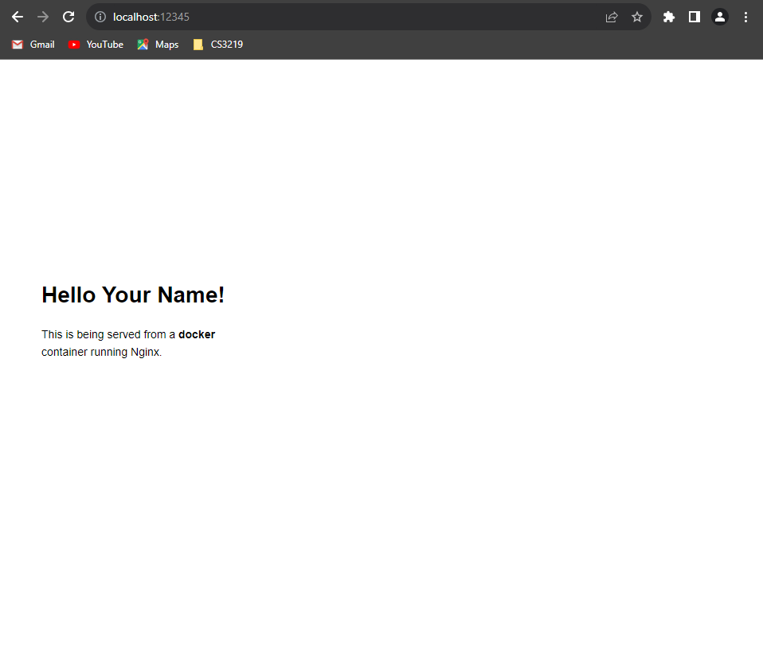

# Toolbox - Containerization
The CS3219 SE Toolbox is a collection of guides and resources to help you get started with the various tools and technologies used CS3219 - Software Engineering Principles and Patterns. 

The guide and resources below  focuses on containerization using Docker.

## Objectives
As you work your way through the [Docker Guide](#1-getting-started-with-docker) you will achieve the following:

1. Setup Docker and learn to interact with the container

   - Setup Docker and test the installation by running a simple container. You can find the instructions in Sections [1.2](#12-installation-and-setup) and [1.3](#13-running-your-first-container-with-docker-run) of the guide. You may choose to run a container of a lightweight image like BusyBox or Alpine.
   - Run an echo command on the image from outside the container
   - Note how to interact with the container.

 _Observe the outcomes of each task and note down your observations. You may find it useful when using Docker later for assignment or project._

2. Learn how to run pre-built images, and publish to ports to view web applications

   - Follow the instructions in Section [1.4](#14-running-a-sample-static-website-with-docker) of the guide.
   - Try publishing to different ports.
   - Additionally you can try this  : Pull and run any Docker image you find interesting in Docker Hub. Explain what it does, and the steps taken to run it.

_Observe the outcomes of each task and note down your observations. You may find it useful when using Docker later for assignment or project._

3.  Learn how to write a Dockerfile to Dockerize your application. And then build and run your custom image.

    - Write a simple ReactJS web application with an ExpressJS server that displays “Hello \<YOUR FULL NAME>, this is running in a Docker container.”
    - Dockerise the above application by writing a Dockerfile. Explain the significance behind the commands used in the Dockerfile.
    - Build and run the image using the Dockerfile you created previously. Map the container port to port 3000 on the host if available.
    - Play around and see if you can run the app on 2 different containers at 2 different ports.

4. Using Docker compose tool

   - Multi-container environments can easily be run using the Docker compose tool.
   - Docker’s [awesome-compose](https://github.com/docker/awesome-compose) samples provide a starting point on how to integrate different frameworks and technologies using Docker compose.
   - Check out the samples in awesome-compose repository and try one/some of them out. They are ready to run with docker compose up.
   - Some questions you can try to answer as you gain experience with `awesome-compose`:
        > - How does docker compose simplify the workflow? 
        > - What does the set of containers you tried help you to achieve? (I.e., what can you do with those set of containers). 
        > - Did you try to compose something different? What difficulties did you face? 


##  Getting Started with Docker
<p align= "center">

</p>

## 1.1. Introduction
[Docker Docs](https://docs.docker.com/) defines Docker as follows: 
> _Docker is an open platform for developing, shipping, and running applications. Docker enables you to separate your applications from your infrastructure so you can deliver software quickly. With Docker, you can manage your infrastructure in the same ways you manage your applications. By taking advantage of Docker’s methodologies for shipping, testing, and deploying code quickly, you can significantly reduce the delay between writing code and running it in production._

Docker allows developers to package their applications and dependencies into a lightweight container by providing a layer of abstraction of OS-level virtualisation on Linux.

Docker containers are relatively well isolated from eachother and the host machine. So, developers can run their applications on any machine that has Docker installed, regardless of the underlying OS.

Unlike virtual machines, containers do not have high overhead and therefore able to efficiently use the system resources.

<details markdown="block">
   <summary> <b>🔍Click here to read about the common concepts and terminologies used in Docker.</b> </summary>
   Before we get our hands dirty, lets familiarise ourselves with some of the common concepts and terminologies associated with Docker.

Docker uses a client-server architecture. The Docker _daemon_ is what builds, runs and distributes the Docker containers. A Docker client communicates with the _daemon_. These can run on same or different machines. The table below summarises the common terminologies used in Docker.

| Term | Desrciption |
| --- | --- |
| Docker Daemon | Listens to Docker API requests. Manages Docker objects - images, containers, networks and volumes. It can also communicate with other daemons. |
| Docker Images | Read-only templates used to create Docker containers. You can create your own image or use pre-existing ones. |
| Docker Container | A runnable instance of an image. You can create, start, stop, move, or delete a container using the Docker API or CLI. |
| Docker Registry | A repository for Docker images. Docker Hub is the default registry. Using `docker pull` or `docker run` commands uses the required images from the configured registry. |
| Docker Client | The primary way users interact with Docker. It sends commands to the Docker Daemon. It can communicate with >1 daemon. |
| Docker Desktop | A GUI tool that includes the Docker daemon, client, Docker Compose, Content Trust, Kubernetes, etc. |
| Docker Objects | Images, containers, networks, volumes, plugins, etc. |

<sup> A part of this table was generated with the help of Github Copilot </sup>
</details>

## 1.2. Installation and Setup
Install Docker for your respective OS [here](https://docs.docker.com/get-docker/).

Follow the instructions/install updates (if any). If successful, you will have installed [Docker Desktop](https://docs.docker.com/desktop/) on your device. 

Docker Desktop provides a GUI to help manage containers, applications, images, etc. It can be used as is or as a complementary tool to the Docker CLI.

> 📝 **Note:** Some parts of this manual will refer to `<your username>` in some of the Docker CLI commands. Replace those with your Docker Hub username. If you do not have a Docker Hub account, create one [here](https://hub.docker.com/signup). If you are using your username for the first time, you may have to login to Docker Hub using the `docker login` command. Sometimes the login command may not work. In that case, you can login to Docker Hub using the Docker Desktop app or restart the terminal and try again.

Test your installation by running the following command in your terminal:
```bash
docker run hello-world
```
If successful, you should see something similar to the following output:
```bash
Hello from Docker!
This message shows that your installation appears to be working correctly.

To generate this message, Docker took the following steps:
 1. The Docker client contacted the Docker daemon.
 2. The Docker daemon pulled the "hello-world" image from the Docker Hub.
    (amd64)
 3. The Docker daemon created a new container from that image which runs the
    executable that produces the output you are currently reading.
 4. The Docker daemon streamed that output to the Docker client, which sent it
    to your terminal.

To try something more ambitious, you can run an Ubuntu container with:
 $ docker run -it ubuntu bash

Share images, automate workflows, and more with a free Docker ID:
 https://hub.docker.com/

For more examples and ideas, visit:
 https://docs.docker.com/get-started/
 ```

 > ⚠️ _**Warning**_ ⚠️
    You will face errors if you don't start the Docker daemon before running the command. If you are using Docker Desktop, you can start the daemon by clicking on the Docker icon in your taskbar/open the Docker Desktop app. If you are using Docker CLI, you can start the daemon by running `dockerd` in your terminal (This option better applies to Linux users).

> 📝 **Note:** Running your terminal and Docker at different privilege levels may cause issues. For example, running your terminal as an administrator and docker as a normal user may cause issues. If you face any issues, try running both at the same privilege level.

## 1.3. Running Your First Container with `docker run`
Now that we have Docker installed and have a basic understanding of Docker, lets run our first container.

> ⏰**Reminder**: Ensure that your Docker daemon is running before you proceed. You may do this by opening the Docker Desktop app or _running `dockerd` in your terminal (this option is for Linux users)_.

We'll run an Alpine Linux container (since it is a lightweight distribution of linux). You can try out the subsequent steps with other images as well - like BusyBox, Ubuntu, etc. 

Enter the command:
```bash
 docker pull alpine
```
This will pull the latest [Alpine](https://hub.docker.com/_/alpine) image from Docker Hub.

If successful, you should see something similar to the following output:
```bash
Using default tag: latest
latest: Pulling from library/alpine
Digest: sha256:82d1e9d7ed48a7523bdebc18cf6290bdb97b82302a8a9c27d4fe885949ea94d1
Status: Image is up to date for alpine:latest
docker.io/library/alpine:latest

What's Next?
  View summary of image vulnerabilities and recommendations → docker scout quickview alpine
```

> ⚠️ _**Warning**_ ⚠️
> If you get a `permission denied` error, check you installation and setup. You may have to run the command as an administrator. If you are using linux  you may have to prefix your command with `sudo`. 


<sup> Figure 1.3.1: This an example of what happens when the `docker pull` command is executed to obtain the alpine image. </sup>

To check the images you have on your system, run the command:
```bash
docker images
```
You should see something akin to the following output:
```bash
REPOSITORY                              TAG       IMAGE ID       CREATED        SIZE
docker/welcome-to-docker                latest    912b66cfd46e   5 weeks ago    13.4MB
postgres                                <none>    696ffaadb338   6 weeks ago    237MB
alpine                                  latest    c1aabb73d233   6 weeks ago    7.33MB
hello-world                             latest    9c7a54a9a43c   2 months ago   13.3kB
```

Now we will run a Docker container based on this image that we just downloaded. For this, we'll use the `docker run` command.

```bash
docker run alpine ls -l
```
You should see something similar to the following output:
```bash
total 56
drwxr-xr-x    2 root     root          4096 Jun 14 15:03 bin
drwxr-xr-x    5 root     root           340 Jul 28 08:55 dev
drwxr-xr-x    1 root     root          4096 Jul 28 08:55 etc
drwxr-xr-x    2 root     root          4096 Jun 14 15:03 home
....
```
Basically what we did was run the `ls -l` command on the Alpine image. This command lists the contents of the current directory. 


<sup> Figure 1.3.2: This an example of what happens when the `docker run` command is executed for an Alpine container. </sup>

Lets try some more commands in the container. Run the following:
```bash
docker run alpine echo "hello from alpine"
```

The output should be:
```bash
hello from alpine
```
Docker essentially ran the `echo` command in the alpine container and exited it. This is normal behaviour. To stay in the container and keep it running, we can use the `-it` flag. This flag allows us to interact with the container (interactive mode). With this, you can also use the Docker container as a development environment. 

```bash
docker run -it alpine
```
You will enter the containers shell. You can now run commands in the container. 
```bash
/ # ls
bin    dev    etc    home   lib    media  mnt    opt    proc   root   run    sbin   srv    sys    tmp    usr    var
/ # cd bin
/bin # cd ..
/ #
```
You can exit the container by running the `exit` command.

To see the containers you are **currently** running, use the `docker ps` command.
```bash
docker ps
```
Output:
```bash
CONTAINER ID   IMAGE     COMMAND   CREATED   STATUS    PORTS     NAMES
```
As you can see, nothing is running right now. Try using the `-a` flag to see all containers that have been run on your system.
```bash
docker ps -a
```
Output:
```bash
CONTAINER ID   IMAGE         COMMAND                  CREATED          STATUS                      PORTS     NAMES
6b9fc12296f2   alpine        "/bin/sh"                3 minutes ago    Exited (0) 2 minutes ago              great_curie
0a57257081b8   alpine        "/bin/sh"                5 minutes ago    Exited (0) 5 minutes ago              friendly_lalande
de280dc604e1   alpine        "echo 'hello from al…"   12 minutes ago   Exited (0) 12 minutes ago             fervent_wiles
c009ae1dded7   alpine        "ls -l"                  38 minutes ago   Exited (0) 38 minutes ago             epic_galois
2c323cbabfb5   hello-world   "/hello"                 26 hours ago     Exited (0) 26 hours ago               zen_noyce
```

Yay! You successfully ran your first container. 🎉

Now that you are equipped with the basics, lets get to the interesting part - deploying web applications with Docker.

## 1.4. Running a Sample Static Website with Docker
In this section, we will pull the [`dockersamples/static-site`](https://hub.docker.com/r/dockersamples/static-site) image from Docker Hub and run a container based on that image. It is a pre-built image that will run a simple HTML static website in an nginx container. 

This exercise will help you understand how to run pre-existing images, and how to publish ports so that you can view your web application.

Run the following command:
```bash
docker run -d dockersamples/static-site
```
> 📝 **Note:** `-d` (or `--detach`) flag runs the container in detached mode, that is, in the background. It runs the container normally, but will bring you to the terminal prompt after the container is started. This is useful when you want to run a container in the background and continue using the terminal.

The output should be a long hex value. This is the full container ID. 
```bash
c3557c35fca64bae767ec7e1b27415425b128dd2cd6af8682fe8a232cfd178ac
```
If the image is not already on your device, the Docker daemon will fetch it from the registry. Then it immediately starts the container and runs it in the background.

How do you see the website that is running? The thing is, we havent specified a port for the Docker engine to publish to. We will have to re-run docker with the `-P` flag to specify the port.

To stop the container, we will retrive the short container ID with the following command:

```bash
docker ps
```
Ideal output:
```bash
CONTAINER ID   IMAGE                       COMMAND                  CREATED         STATUS         PORTS             NAMES
c3557c35fca6   dockersamples/static-site   "/bin/sh -c 'cd /usr…"   6 minutes ago   Up 6 minutes   80/tcp, 443/tcp   epic_cerf
```

Use the container ID to refer to the container you want to stop. In this case, it is `c3557c35fca6`. Run the following command:
```bash
docker stop c3557c35fca6
```
Then remove it using the following command:
```bash
docker rm c3557c35fca6
```

Run the following command to run the container again, but specifying the port:
```bash
docker run --name static-site -e AUTHOR="Your Name" -d -P dockersamples/static-site
```

> 📝 **Note:** `--name` flag allows you to specify a name for the container. `-e` flag allows you to set environment variables. In this case, we set the AUTHOR variable to our name. This will be displayed on the website. `-P` flag publishes all exposed ports to random ports. This is useful when you don't know which port the application will use.

Now see the port using the following command:
```bash
docker port static-site
```
Output:
```bash
80/tcp -> 0.0.0.0:32769
443/tcp -> 0.0.0.0:32768
```

Since we are using Docker Desktop, open `http://localhost:[PORT FOR 80/tcp]/` in your browser. In this example it is `http:\\localhost:32769`. You should see the following page:


<sup> Figure 1.4.1: This is an example of the static website. </sup>

You can run another webserver at the same time. Previously, we used random ports. But we can also specify the port we want to use. Run the following command:
```bash
docker run --name static-site-2 -e AUTHOR="Your Name" -d -p 12345:80 dockersamples/static-site
```
Open `http://localhost:12345` in your browser. 



<sup> Figure 1.4.2: This is an example of the static website running in parallel on port 12345. </sup>

> ⏰**Reminder**: Stop and remove the containers after you are done with them. Run `docker ps` to make sure they are gone.

## 1.5. Building and Running Your Own Docker Image
In the previous exercise, we ran a static website using an existing image from Docker Hub. In this section, we will build our own image.

<details markdown="block">
   <summary><b>🔍Click here to find out more about Images in Docker.</b></summary>
   As mentioned before, Docker images are the basis of containers. They contain all the required dependencies and configurations to run an application. When a user runs an image, it becomes one or multiple instances of that container.

To see the list of images available locally on your system, run the following command:
```bash
docker images
```
Below is an example of the output:
```bash
REPOSITORY                              TAG       IMAGE ID       CREATED        SIZE
<your username>/myfirstapp               latest    a87769a45bf9   6 days ago     56.8MB
multi-container-app-todo-app            latest    face6e84540a   6 days ago     196MB
mongo                                   6         fb5fba25b25a   2 weeks ago    654MB
redis                                   <none>    c1dc010e6f24   2 weeks ago    30.2MB
docker/welcome-to-docker                latest    912b66cfd46e   5 weeks ago    13.4MB
postgres                                <none>    696ffaadb338   6 weeks ago    237MB
alpine                                  latest    c1aabb73d233   6 weeks ago    7.33MB
hello-world                             latest    9c7a54a9a43c   2 months ago   13.3kB
dockersamples/examplevotingapp_result   <none>    6ce23a8ce243   7 months ago   256MB
dockersamples/examplevotingapp_vote     <none>    04e406d349f5   7 months ago   142MB
dockersamples/examplevotingapp_worker   <none>    03edceb3a0f9   7 months ago   194MB
dockersamples/visualizer                <none>    43ce62428b8c   2 years ago    185MB
postgres                                <none>    ed5a45034282   3 years ago    251MB
dockersamples/static-site               latest    f589ccde7957   7 years ago    191MB
```
This is a list of the images that have been created and/or pulled from the registry on that particular machine. 

Images can be classified into some types based on their usage and source. See the image below for more information:


<sup>Figure 1.5.1: Classification of Images in Docker</sup>
</details>

The goal is to create a Docker image that sandboxes a simple React + ExpressJS application.

First we will put together a simple React App with an ExpressJS server, then dockerize it by writing a Dockerfile. Finally, we will build and run the image.

### 1.5.1. Creating a Simple React App
_Prerequisites: Install NodeJS (with npm) and yarn if you haven't already. We suggest that you use this node version for the purposes of this module => LTS v18.17.0, npm is v9.6.7 and yarn v1.22.19._

If you already have a React app with Express server you'd like to dockerize, you go the [the next section](#152-writing-a-dockerfile).

Inside the folder you want to create the  project, run the following commands:

```bash
mkdir test
cd test
npm init -y
npm install express --save
npm i -g create-react-app
```
This will create a new folder called `test` and initialise a new node project. Then it will install express and create-react-app globally.

You should have `node_modules`, `package-lock.json` and `package.json` in your folder. 

> ⚠️ _**Warning**_ ⚠️: If you are using an old version of npm, you may not have `package-lock.json`. This is a reminder to use a newer version of npm. 

Now we will create a React app. Run the following commands:
```bash
create-react-app testapp
cd testapp
yarn start
```
> 📝 **Note:**: You can also use `npm start` instead of `yarn start`. But make sure you configure the predefined command specified in the "start" property of a package's "scripts" object in `package.json` i.e. set it to "node index.js" for the purposes of this application.

`testapp` is the name of the React app. You can name it whatever you want. `yarn start` will start the development server. You should see the following page open in your browser:


<sup>Figure 1.5.1.1: React sample application running on localhost:3000</sup>

Use control + c to stop the development server. Build the project using `yarn build`. This will create a `build` folder in your project directory. Find it in `testapp/build`.

Go back to the root folder, `test`. Create a file called `index.js`. We will develop the production server for the app here. 

The development server included in create-react-app is not suitable to serve a react app over the internet. It is not optimised for performance and security. We will use ExpressJS to serve the production build of the React app.

Inside `index.js`, add the following code:

```javascript
const express = require('express');
const app = express();

// Serve up production assets
app.use(express.static('testapp/build'));

// Serve up the index.html if the route is not recognized
const path = require('path');
app.get('*', (req, res) => {
    res.sendFile(path.resolve(__dirname, 'testapp', 'build', 'index.html'));
});

// If not in production, use port 8080 or the environment port
const PORT = process.env.PORT || 8080;
console.log(`Listening on port ${PORT}`);
app.listen(PORT);
```
<details markdown="block">
<summary> <b>🔍Click here to find out more about what the code above does</b></summary>
The code above sets up an Express server that serves a React web application in production. It first serves static assets from the 'testapp/build' folder. If a route is not recognized, it sends the 'index.html' file from the same folder, allowing the React app to handle the routing on the client-side. The server listens on the port defined by the environment variable 'PORT', and if not set, it defaults to port 8080.
</details>
<br>

> ⏰**Reminder**: `testapp` is the name of the React app. If you named it something else, change the code accordingly.

Run `node index.js` to start the server. Go to http://localhost:8080/ to see the React app running.

Yay! You have successfully created a simple React app with an ExpressJS server. 🎉

### 1.5.2. Writing a Dockerfile
Now that we have a simple React app with an ExpressJS server, we will write a Dockerfile to containerise it.

A Dockerfile is a simple text document that provides users with a set of clear instructions for building an image using the command line. 

Docker can build images automatically by reading the instructions from a Dockerfile. 

Create a file called `Dockerfile` in the project folder. With reference to the previous section, that would be in the `test` folder.

In the Dockerfile we will specify the base image, copy the required files, install dependencies, and start the server. Follow the instructions below to write the Dockerfile.

1. Specify the base image. We will use the `node:18` image. This is the latest long term support (LTS) version of node.  
```Dockerfile
FROM node:18
```
1. Specify the working directory. This is where the files will be copied to inside the image.  
```Dockerfile
WORKDIR /usr/src/app
```
1. The image comes with NodeJS and npm pre-installed. We will copy the `package.json` and `package-lock.json` files to the working directory. Then we will install the remaining dependencies.  
```Dockerfile
COPY package*.json ./
```
1. Install the dependencies.  
```Dockerfile
RUN npm install
```
1. Add this line, but keep it commented. Uncomment it if you are building code for production.
```Dockerfile
# RUN npm ci --omit=dev
```
1. Bundle the app's source code inside the Docker image.  
```Dockerfile
COPY . .
```
1. Expose the port 8080 so it can be mapped by the Docker daemon.   
```Dockerfile
EXPOSE 8080
```
1. Specify the command to run the app.  
```Dockerfile
CMD ["node", "index.js"]
```

At the end, your Dockerfile will look something like this:
```Dockerfile
# Define the image you want to build from.
# In this case, we are using the latest LTS (long term support) version of Node.
FROM node:18

# Create app directory to hold application code inside the image.
WORKDIR /usr/src/app

# The image comes with Node.js and NPM already installed.
# We just need to install the rest of our dependencies.
# Copy package.json and package-lock.json to the app directory on the image.
COPY package*.json ./

# Install dependencies.
RUN npm install

# Uncomment the following line if you are building code for production.
# RUN npm ci --omit=dev

# Bundle the app's source code inside the Docker image.
COPY . .

# Expose port 8080 so it can be mapped by Docker daemon.
EXPOSE 8080

# Define the command to run your app using CMD which defines your runtime.
CMD [ "node", "index.js" ]
```
Create a `.dockerignore` file in the project folder. This file specifies the files and folders that should be ignored when copying files to the image. Add the following lines to the file:
```bash
node_modules
npm-debug.log
```

Great job! You have successfully written a Dockerfile. 🎉 Note that Dockerfiles are specific to the application they are building and the environment they are running in. So if you would like to dockerize a different kind of application, you will have to write a different Dockerfile.

<!-- <details>
<summary> <b>🔍Click here to find out more about commands in Dockerfiles</b></summary>
The syntax and commands used in Dockerfiles are as follows:
1. `FROM`
Defines the base image to use to start the build process. It has to be the first command in the Dockerfile. A Dockerfile can have multiple `FROM` statements. That means the Dockerfile can create multiple images. 
<i>Example: </i> `FROM ubuntu:18.04`

</details> -->

### 1.5.3. Building and Running the Image

> ⏰**Reminder**: Ensure that your Docker daemon is running before you proceed. You may do this by opening the Docker Desktop app or _running `dockerd` in your terminal (this option is for Linux users)_.

In the directory that contains your Dockerfile, run the following command to build the image:
```bash
docker build . -t <your username>/test-web-app
```
> 📝 **Note:** The `-t` flag tags the image. This is useful when you want to refer to the image later. You can name it whatever you want. In this case, it is named `test-web-app`. Also remember to replace `<your username>` with your Docker Hub username. 

Once the build is complete, check if your image is now listed by docker. 

<details markdown="block">
  <summary><b>❓Do you remember which command you have to run to check the images on your machine?</b></summary>
  
   You're right, the `docker images` command can help you check!
</details>
<br>
The result should contain your image. In this case, it is `<your username>/test-web-app`.

```bash
REPOSITORY                              TAG       IMAGE ID       CREATED          SIZE
<your username>/test-web-app             latest    5840e4960d7e   15 seconds ago   1.39GB
```

Run your image using the following command:
```bash
docker run -p 12345:8080 -d <your username>/test-web-app
```

<details markdown="block">
  <summary><b>❓Can you recall what the -p and -d tags do?</b></summary>
   The -p tag publishes the container's port to the host. In this case the container is listening at 8080 and that port is being mapped to 12345 on the host. 
   
   The -d tag runs the container in detached mode.
</details>
<br>

If you want to see the console logs printed in the container, run the following command:
```bash
docker logs <container id>
```

You should see the following output:
```bash
Listening on port 8080
```

<details markdown="block">
  <summary><b>❓How to obtain the container ID? </b></summary>

   You can use the `docker ps` command to see the containers that are currently running.
</details>
<br>

One you have run the command to get the container ID, the output also provides some interesting information - _port mappings_.
You will get an output like this:
```bash
   CONTAINER ID   IMAGE                         COMMAND                  CREATED         STATUS         PORTS                     NAMES
b2bea1366fa2   <your username>/test-web-app   "docker-entrypoint.s…"   8 seconds ago   Up 7 seconds   0.0.0.0:12345->8080
```

Here, Docker mapped the port 8080 in the container to port 12345 on the host. 

Access your web app at `http://localhost:12345/`. You should see the following page:


<sup>Figure 1.5.3.1: React sample application running on localhost:12345</sup>

Yay! You have successfully dockerized your simple React app. 🎉

<details markdown="block">
  <summary><b>❓Did you remember to shut down the container once you were done? </b></summary>
  
   Use `docker stop CONTAINER ID` to stop the container. Followed by `docker rm CONTAINER ID` to remove the container. This will free up space if you aren't using the container anymore.
</details>
<br>

## References

The information in this guide has been collated from the following sources:
- [Docker Docs](https://docs.docker.com/)
- [Docker Labs](https://github.com/docker/labs/)
- [Dockerizing a Node.js Web App](https://nodejs.org/en/docs/guides/nodejs-docker-webapp)
- [Deploy a React App with Node.js](https://medium.com/@achillesmoraites/serve-a-react-app-with-express-server-c5986769bac)
- [Docker Curriculum - A Docker Tutorial for Beginners](https://docker-curriculum.com/)
- [Github Copilot](https://copilot.github.com/) was used to generate some of the content in the Docker guide.
- [ChatGPT](https://chat.openai.com/) helped with providing an outline for the Docker guide.
