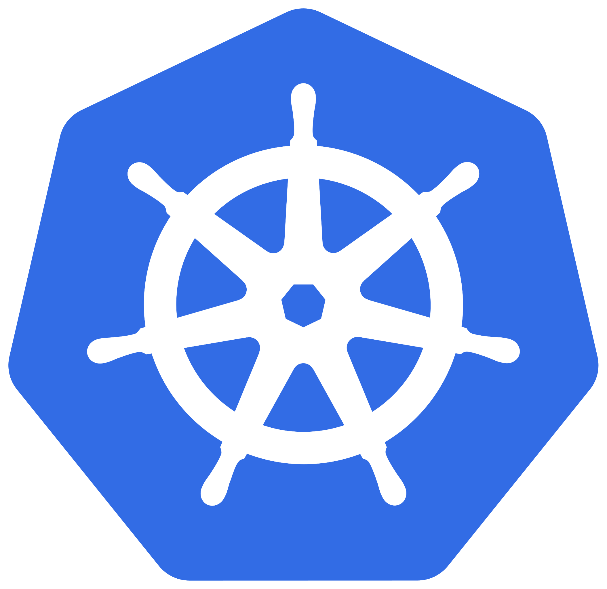
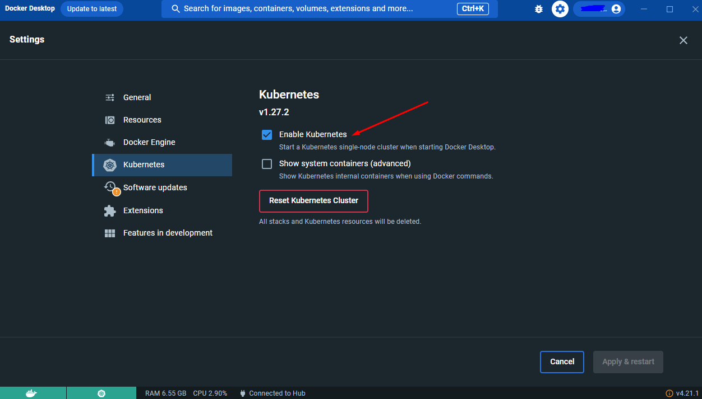
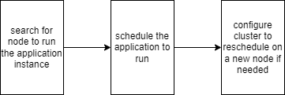
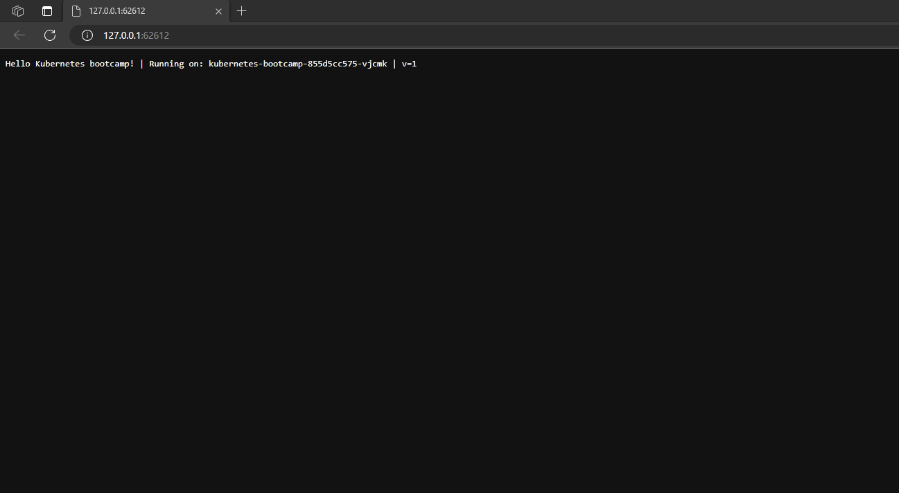
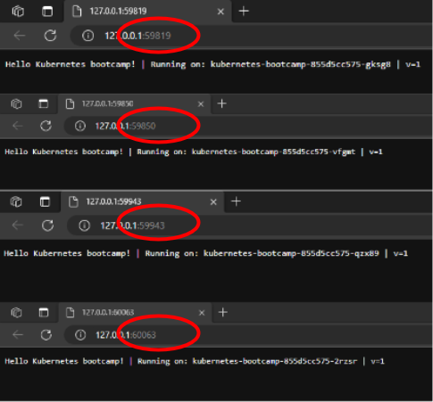
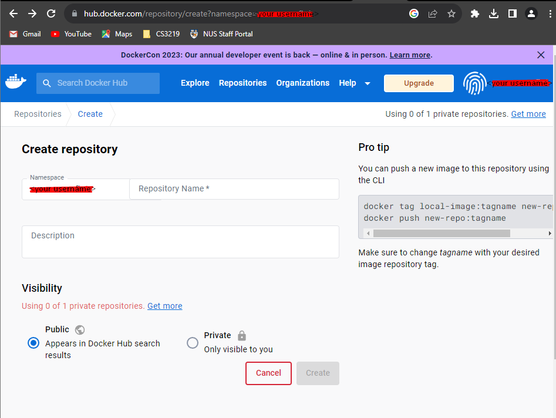
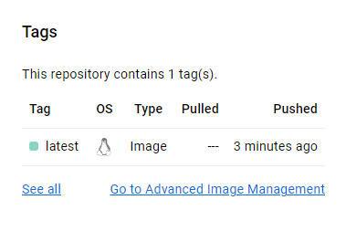
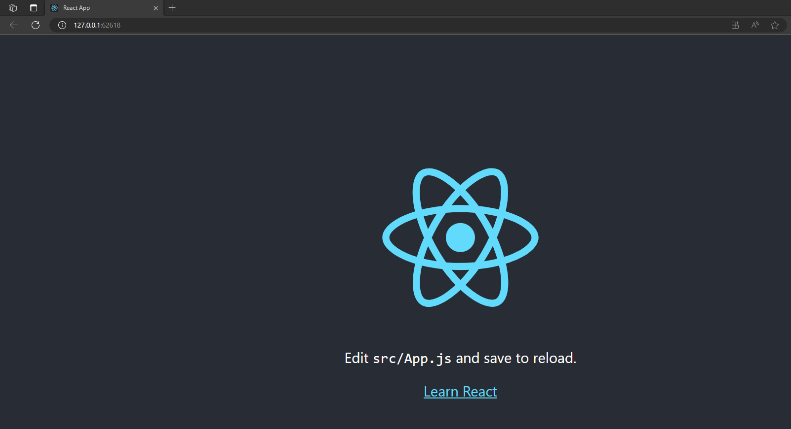
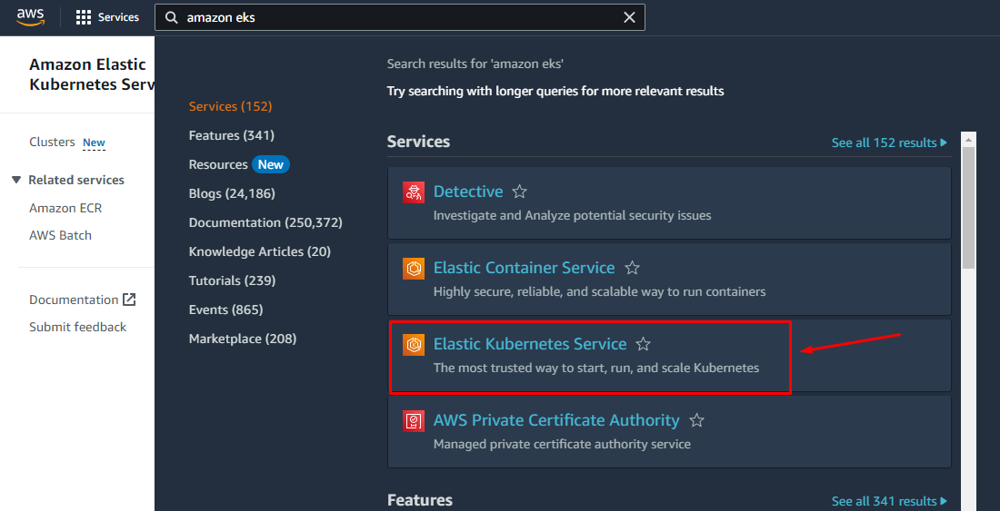
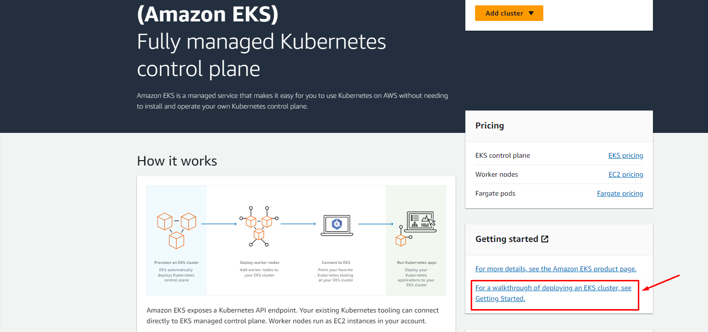

# CS3219 SE Toolbox: Kubernetes
The CS3219 SE Toolbox is a collection of guides and resources to help you get started with the various tools and technologies used CS3219 - Software Engineering Principles and Patterns.

This guide will help you get started with Kubernetes. It will cover the basics of Kubernetes and how to deploy a sample application using Kubernetes. Finally, it will cover how to use Amazon Elastic Kubernetes Service (EKS).

# 1. A Guide to Getting Started with Kubernetes

<p align= "center">

</p>

_**Table of Contents**_
- [CS3219 SE Toolbox: Kubernetes](#cs3219-se-toolbox-kubernetes)
- [1. A Guide to Getting Started with Kubernetes](#1-a-guide-to-getting-started-with-kubernetes)
    - [1.1. Introduction](#11-introduction)
    - [1.2. Installation and Setup](#12-installation-and-setup)
    - [1.3. Create a Kubernetes Cluster](#13-create-a-kubernetes-cluster)
    - [1.4. Deploy an Application](#14-deploy-an-application)
        - [1.4.1 Explore the Application](#141-explore-the-application)
        - [1.4.2 View the Container Logs](#142-view-the-container-logs)
        - [1.4.3 Execute Commands on the Container](#143-execute-commands-on-the-container)
    - [1.5. Expose the App Publicly](#15-expose-the-app-publicly)
    - [1.6. Scale and Update the App](#16-scale-and-update-the-app)
        - [1.6.1. Scale Up](#161-scale-up)
        - [1.6.2. Load Balancing](#162-load-balancing)
        - [1.6.3. Scale Down](#163-scale-down)
        - [1.6.4. Update the Application](#164-update-the-application)
- [2. Deploying a React + Express JS Application using Kubernetes + Docker](#2-deploying-a-react--express-js-application-using-kubernetes--docker)
    - [2.1. Upload the Image to Docker Hub](#21-upload-the-image-to-docker-hub)
    - [2.2. Start Minikube](#22-start-minikube)
    - [2.3. Create a Deployment](#23-create-a-deployment)
    - [2.4. Expose the Deployment](#24-expose-the-deployment)
- [3. Amazon Elastic Kubernetes Service (EKS)](#3-amazon-elastic-kubernetes-service-eks)
    - [3.1. Prerequisites and Installation](#31-prerequisites-and-installation)
    - [3.2. Create a Cluster](#32-create-a-cluster)
    - [3.3. View the Kuberenetes Resources](#33-view-the-kuberenetes-resources)
    - [3.4. Deploy the Application](#34-deploy-the-application)
- [4. References](#4-references)

<small><i><a href='http://ecotrust-canada.github.io/markdown-toc/'>Table of contents generated with markdown-toc</a></i></small>


## 1.1. Introduction
To a certain extent, Docker is widely used as a tool that makes it easy to package and deploy applications in containers. This ensures that applications behave consistently whether you are using them on your laptop or in the cloud.

However, as the demands of scalability and intricacy increase, the containerised Docker may not fully meet these requirements. This is where orchestration tools like Kubernetes come in. Many organisations are now adopting Kubernetes as an advanced abstraction layer to efficiently manage their containerised infrastructure. This simplifies workflows and enables teams to accelerate their processes.

<sup> The above text was partially generated with the help of [ChatGPT](https://chat.openai.com/)</sup>

<details open markdown="block">
<summary> <b> 🔍 Click here to find out more on why Kubernetes is widely used. </b></summary>

Kubernetes simplifies the deployment process for applications. It also provides tools that help make the application robust. The following table describes the key features and benefits of Kubernetes.

| Feature | Benefits |
| --- | --- |
| **Service discovery and load balancing** | Kubernetes can expose containers via DNS names or unique IP addresses, while also adeptly balancing and distributing high network traffic to ensure stable deployments. |
| **Storage orchestration** | Kubernetes provides the capability to seamlessly attach various storage systems of your preference, including local storage and public cloud providers, among others. |
| **Automated rollouts and rollbacks** | Kubernetes allows you to roll out new application versions without downtime, and also roll back to previous versions if required. |
| **Automatic bin packing** | You give Kubernetes a node cluster. Specify CPU and memory needs per container. Kubernetes optimizes container placement on nodes for efficient resource utilization. |
| **Self-healing** | Kubernetes automatically restarts failed containers, substitutes and reschedules containers in the event of node failures, terminates unresponsive containers based on user-defined health checks, and only exposes containers to clients once they are fully operational. |
| **Secret and configuration management** | Kubernetes enables secure storage and management of sensitive data like passwords, OAuth tokens, and SSH keys. You can deploy and update secrets and app configurations without rebuilding images or revealing secrets in your stack setup. |

<sup> This table was generated with the help of [Github Copilot](https://copilot.github.com/) and [ChatGPT](https://chat.openai.com/).</sup>

</details>

## 1.2. Installation and Setup
The most common ways to run a Kubernetes cluster locally are using [Minikube](https://minikube.sigs.k8s.io/docs/) **or** [Docker Desktop](https://www.docker.com/products/docker-desktop). This tutorial will focus on Minikube.

Minikube serves as a local Kubernetes solution, with a primary emphasis on simplifying Kubernetes learning and development.

All you need is [Docker](https://www.docker.com/products/docker-desktop) (or similarly compatible) container **or** a [Virtual Machine](https://www.virtualbox.org/wiki/Downloads), and [Minikube](https://minikube.sigs.k8s.io/docs/) will take care of the rest.

You should have installed Docker for one of the previous tutorials. If you haven't, you can find the installation instructions [here](https://docs.docker.com/get-docker/).

Follow the instructions [here](https://minikube.sigs.k8s.io/docs/start/) to install Minikube for your OS.

Once you are done, check that minikube is installed correctly by running:
```bash
minikube version
```
It should return the version of minikube and the commit hash.

Also check if you have `kubectl` installed by running:
```bash
kubectl version
```
You will need it to access your cluster. Alternatively, you can get minikube to install it for you by running:
```bash
minikube kubectl -- get po -A
```
If `kubectl version` returns both the client and server versions, you are good to go.

## 1.3. Create a Kubernetes Cluster
This section will guide you through the process of deploying a local Kubernetes cluster using Minikube.

For this guide, we recommend the Docker driver for Minikube. If you would like to use a different driver (at your own risk), you can find the instructions [here](https://minikube.sigs.k8s.io/docs/drivers/).

> ⏰**Reminder**: Start the Docker daemon (by opening Docker Desktop) and enable the Kubernetes service in Docker Desktop before proceeding.  <sup> Figure 1.3.1: Enabling Kubernetes in Docker Desktop </sup>


Start the cluster by running:
```bash
minikube start --driver=docker
```
View cluster details using `kubectl cluster-info`. You'll get something similar to this:
```bash
Kubernetes control plane is running at https://127.0.0.1:64151
CoreDNS is running at https://127.0.0.1:64151/api/v1/namespaces/kube-system/services/kube-dns:dns/proxy

To further debug and diagnose cluster problems, use 'kubectl cluster-info dump'.
```

In this segment of the guide, we are focusing on the command line for deploying an application. However, you can also use the [Kubernetes dashboard](https://minikube.sigs.k8s.io/docs/handbook/dashboard/) to view your cluster.

To see all nodes that can be used to host the applications, use the `kubectl get nodes` command. You should get something similar to this:
```bash
NAME       STATUS   ROLES           AGE   VERSION
minikube   Ready    control-plane   21m   v1.27.3
```
It can be seen that there is 1 node. The status is 'ready' which means it is ready to accept applications for deployment.

## 1.4. Deploy an Application
This section will help you learn the basics of `kubectl` and deploy a sample application.

Deploy a sample application by running:
```bash
kubectl create deployment kubernetes-bootcamp --image=gcr.io/google-samples/kubernetes-bootcamp:v1
```
This command will create a deployment called `kubernetes-bootcamp` and use the `gcr.io/google-samples/kubernetes-bootcamp:v1` container image. This image is taken from the Google Cloud Platform (GCP) registry.

This is what happens when create a deployment:


<sup> Figure 1.4.1: Deploying an application </sup>

Run `kubectl get deployments` to see the deployment you just created:
```bash
NAME                  READY   UP-TO-DATE   AVAILABLE   AGE
kubernetes-bootcamp   1/1     1            1           51s
```
It can be seen that there is 1 deployment running a single instance of the application. It runs inside a Docker container in the node.

> 📝**Note**: Kubernetes pods have a private network. They're visible within the cluster but not outside. When employing `kubectl`, we connect via an API endpoint to communicate with our application.
The `kubectl` command is capable of generating a proxy, facilitating communication into the private network across the entire cluster. To halt the proxy, you can use control-C, and it will operate without displaying any output while active.

<sup> This note was generated with the help of [ChatGPT](https://chat.openai.com/)</sup>

Open another terminal to run the proxy:
```bash
kubectl proxy
```
You will see something similar to this:
```bash
Starting to serve on 127.0.0.1:8001
```
Take note of the port number. In this case, it is 8001.

This runs the proxy in the background, return to your original terminal window. Now the host machine (your computer) can communicate with the Kubernetes cluster. You can access the APIs hosted through the proxy endpoint. Try querying the version through the API by running:
```bash
curl http://localhost:8001/version
```

> ⏰**Reminder**:Remember to replace the port number with the one you got from running `kubectl proxy`. Also note that the proxy must be running for this to work.

<details open markdown="block">
<summary> <b>🔍 Click here to see the output.</b></summary>

```bash
StatusCode        : 200
StatusDescription : OK
Content           : {
                      "major": "1",
                      "minor": "27",
                      "gitVersion": "v1.27.3",
                      "gitCommit": "25b4e43193bcda6c7328a6d147b1fb73a33f1598",
                      "gitTreeState": "clean",
                      "buildDate": "2023-06-14T09:47:40Z",
                      "goVersion"...
RawContent        : HTTP/1.1 200 OK
                    Audit-Id: 5d958417-89e4-4835-aaf3-ae3f3530d535
                    X-Kubernetes-Pf-Flowschema-Uid: b4748383-acc3-468c-8172-90174f345c5d
                    X-Kubernetes-Pf-Prioritylevel-Uid: 0c632f7f-10da-49f9-8131-f80ef3...
Forms             : {}
Headers           : {[Audit-Id, 5d958417-89e4-4835-aaf3-ae3f3530d535], [X-Kubernetes-Pf-Flowschema-Uid,
                    b4748383-acc3-468c-8172-90174f345c5d], [X-Kubernetes-Pf-Prioritylevel-Uid,
                    0c632f7f-10da-49f9-8131-f80ef3043107], [Content-Length, 263]...}
Images            : {}
InputFields       : {}
Links             : {}
ParsedHtml        : mshtml.HTMLDocumentClass
RawContentLength  : 263
```
</details>

The API creates and endpoint for each pod in the cluster. To access the pod, you need to know its name. You can get the name of the pod by running:
```bash
kubectl get pods
```
You will get something similar to this:
```bash
NAME                                   READY   STATUS    RESTARTS   AGE
kubernetes-bootcamp-855d5cc575-vjcmk   1/1     Running   0          44m
```
In this case, the pod name is `kubernetes-bootcamp-855d5cc575-vjcmk`. You can now access the pod through the API by running:
```bash
curl http://localhost:8001/api/v1/namespaces/default/pods/<PODNAME>
```
> ⏰**Reminder**: Remember to replace the port number with the one you got from running `kubectl proxy`. Also remember to replace `<PODNAME>` with the pod name you got from running `kubectl get pods`.

So your command will look something like this:
```
curl http://localhost:8001/api/v1/namespaces/default/pods/kubernetes-bootcamp-855d5cc575-vjcmk
```

Note that this URL is the route to the API endpoint for the pod.

<details open markdown="block">
<summary> <b>🔍 Click here to see the output.</b></summary>

```bash
StatusCode        : 200
StatusDescription : OK
Content           : {
                      "kind": "Pod",
                      "apiVersion": "v1",
                      "metadata": {
                        "name": "kubernetes-bootcamp-855d5cc575-vjcmk",
                        "generateName": "kubernetes-bootcamp-855d5cc575-",
                        "namespace": "default",
                        "uid...
RawContent        : HTTP/1.1 200 OK
                    Audit-Id: 092a5724-a854-4fc9-9b6b-b302345c63d9
                    X-Kubernetes-Pf-Flowschema-Uid: b4748383-acc3-468c-8172-90174f345c5d
                    X-Kubernetes-Pf-Prioritylevel-Uid: 0c632f7f-10da-49f9-8131-f80ef3...
Forms             : {}
Headers           : {[Audit-Id, 092a5724-a854-4fc9-9b6b-b302345c63d9], [X-Kubernetes-Pf-Flowschema-Uid,
                    b4748383-acc3-468c-8172-90174f345c5d], [X-Kubernetes-Pf-Prioritylevel-Uid,
                    0c632f7f-10da-49f9-8131-f80ef3043107], [Transfer-Encoding, chunked]...}
Images            : {}
InputFields       : {}
Links             : {}
ParsedHtml        : mshtml.HTMLDocumentClass
RawContentLength  : 7041
```

</details>

Yay! You just accessed the pod through the API.

### 1.4.1 Explore the Application
View the containers running inside the pod by running:
```bash
kubectl describe pods
```
<details open markdown="block">
<summary> <b>🔍 Click here to see the output.</b></summary>

```bash
Name:             kubernetes-bootcamp-855d5cc575-vjcmk
Namespace:        default
Priority:         0
Service Account:  default
Node:             minikube/192.168.67.2
Start Time:       Fri, 11 Aug 2023 11:26:39 +0800
Labels:           app=kubernetes-bootcamp
                  pod-template-hash=855d5cc575
Annotations:      <none>
Status:           Running
IP:               10.244.0.3
IPs:
  IP:           10.244.0.3
Controlled By:  ReplicaSet/kubernetes-bootcamp-855d5cc575
Containers:
  kubernetes-bootcamp:
    Container ID:   docker://3a955af528474f008155f8ec5c038a181988c0a4e7028c78d9a089b9f53023ca
    Image:          gcr.io/google-samples/kubernetes-bootcamp:v1
    Image ID:       docker-pullable://gcr.io/google-samples/kubernetes-bootcamp@sha256:0d6b8ee63bb57c5f5b6156f446b3bc3b3c143d233037f3a2f00e279c8fcc64af
    Port:           <none>
    Host Port:      <none>
    State:          Running
      Started:      Fri, 11 Aug 2023 11:26:54 +0800
    Ready:          True
    Restart Count:  0
    Environment:    <none>
    Mounts:
      /var/run/secrets/kubernetes.io/serviceaccount from kube-api-access-gbn5k (ro)
Conditions:
  Type              Status
  Initialized       True
  Ready             True
  ContainersReady   True
  PodScheduled      True
Volumes:
  kube-api-access-gbn5k:
    Type:                    Projected (a volume that contains injected data from multiple sources)
    TokenExpirationSeconds:  3607
    ConfigMapName:           kube-root-ca.crt
    ConfigMapOptional:       <nil>
    DownwardAPI:             true
QoS Class:                   BestEffort
Node-Selectors:              <none>
Tolerations:                 node.kubernetes.io/not-ready:NoExecute op=Exists for 300s
                             node.kubernetes.io/unreachable:NoExecute op=Exists for 300s
Events:
  Type    Reason     Age   From               Message
  ----    ------     ----  ----               -------
  Normal  Scheduled  52m   default-scheduler  Successfully assigned default/kubernetes-bootcamp-855d5cc575-vjcmk to minikube
  Normal  Pulling    52m   kubelet            Pulling image "gcr.io/google-samples/kubernetes-bootcamp:v1"
  Normal  Pulled     52m   kubelet            Successfully pulled image "gcr.io/google-samples/kubernetes-bootcamp:v1" in 13.579247s (13.5792534s including waiting)
  Normal  Created    52m   kubelet            Created container kubernetes-bootcamp
  Normal  Started    52m   kubelet            Started container kubernetes-bootcamp
```
</details>

Here we can see te details about the pods including the containers running inside the pod. Like IP address, image, container ID, etc.

### 1.4.2 View the Container Logs
Logs for the container within the Pod are formed from anything that the application typically sends to STDOUT. These logs can be obtained using this command:
```bash
kubectl logs <PODNAME>
```
This returns the logs from the single container running in the pod. You can also use the `-c` flag with the `kubectl logs` command to specify which container to retrieve logs for, in case there are multiple containers running inside the pod.

The output of the command should look like this:
```bash
Kubernetes Bootcamp App Started At: 2023-08-11T03:26:54.065Z | Running On:  kubernetes-bootcamp-855d5cc575-vjcmk
```

### 1.4.3 Execute Commands on the Container
Once the Pod is operational, we have the capability to run commands directly on the container. To achieve this, the `exec` command is used, taking the Pod's name as a parameter. For example, to list the environment variables:
```bash
kubectl exec <PODNAME> -- env
```

<details open markdown="block">
<summary>❓<b> Do you remember how to find the pod name?</b></summary>

```bash
kubectl get pods
```
</details>
<br> 

The -- flag is used to pass the command to the container. The output of the command should look like this:
```bash
PATH=/usr/local/sbin:/usr/local/bin:/usr/sbin:/usr/bin:/sbin:/bin
HOSTNAME=kubernetes-bootcamp-855d5cc575-vjcmk
KUBERNETES_PORT_443_TCP_PROTO=tcp
KUBERNETES_PORT_443_TCP_PORT=443
KUBERNETES_PORT_443_TCP_ADDR=10.96.0.1
KUBERNETES_SERVICE_HOST=10.96.0.1
KUBERNETES_SERVICE_PORT=443
KUBERNETES_SERVICE_PORT_HTTPS=443
KUBERNETES_PORT=tcp://10.96.0.1:443
KUBERNETES_PORT_443_TCP=tcp://10.96.0.1:443
NPM_CONFIG_LOGLEVEL=info
NODE_VERSION=6.3.1
HOME=/root
```
The `env` command lists all environment variables that are configured for the container.
Since there is only one container within the Pod, we do not need to specify which container to run the command against.

To start a bash session in the Pod's container, run this command:
```bash
kubectl exec -ti <PODNAME> -- bash
```
You are now in the container (most likely in the root). It will look something like this:
```bash
root@kubernetes-bootcamp-855d5cc575-vjcmk:/#_
```
You can run any command that is installed in the container (like ls, cd etc). For example, check out the source code of the sample application:
```bash
cat server.js
```
<details open markdown="block">
<summary> <b>🔍 Click here to see the output.</b></summary>

```bash
var http = require('http');
var requests=0;
var podname= process.env.HOSTNAME;
var startTime;
var host;
var handleRequest = function(request, response) {
  response.setHeader('Content-Type', 'text/plain');
  response.writeHead(200);
  response.write("Hello Kubernetes bootcamp! | Running on: ");
  response.write(host);
  response.end(" | v=1\n");
  console.log("Running On:" ,host, "| Total Requests:", ++requests,"| App Uptime:", (new Date() - startTime)/1000 , "seconds", "| Log Time:",new Date());
}
var www = http.createServer(handleRequest);
www.listen(8080,function () {
    startTime = new Date();;
    host = process.env.HOSTNAME;
    console.log ("Kubernetes Bootcamp App Started At:",startTime, "| Running On: " ,host, "\n" );
});
```
</details>

According to the source code, the application is listening on port 8080. Use the curl command to see if the application is running:
```bash
curl localhost:8080
```
Your output should look like this:
```bash
Hello Kubernetes bootcamp! | Running on: kubernetes-bootcamp-855d5cc575-vjcmk | v=1
```
> ⏰**Reminder**: You should still be in the container in order run these commands. If you are getting errors, make sure you have run the `kubectl exec -ti <PODNAME> -- bash` command.

To exit the container, type `exit`.


## 1.5. Expose the App Publicly
The application is currently running on the cluster, but is not yet accessible from the outside. To make the application accessible from outside the Kubernetes virtual network, you have to expose the application as a Kubernetes Service.

> ⏰**Reminder**: At this point the proxy is still running in the other terminal window. You may close it by pressing `CTRL+C`.

To verify the application is running, check if the pod is still up and running.
<details open markdown>
<summary>❓<b>How to find existing pods?</b></summary>

```bash
kubectl get pods
```
</details>

List the current services:
```bash
kubectl get services
```
Output:
```bash
NAME         TYPE        CLUSTER-IP   EXTERNAL-IP   PORT(S)   AGE
kubernetes   ClusterIP   10.96.0.1    <none>        443/TCP   3h27m
```
The output shows that the cluster has a single service called `kubernetes`, which serves the Kubernetes API. This service starts by default when minikube starts the cluster. The `EXTERNAL-IP` column is empty, which means that the service is only accessible from within the cluster.

So we have to create a new service to expose the application to external traffic. To do this, we use the `kubectl expose` command:
```bash 
kubectl expose deployment/kubernetes-bootcamp --type="NodePort" --port 8080
```
> 📝**Note**: `--type="NodePort"` flag specifies the type of exposure, which is a "NodePort." It means that Kubernetes will assign a port on each node to forward traffic to the exposed application. The `--port 8080` flag  sets the port number (8080) on which the application inside the deployment is running. It tells Kubernetes to direct external requests to this port on the exposed service.

If successful, the command returns:
```bash
service/kubernetes-bootcamp exposed
```
Run the `kubectl get services` command again:
```bash
NAME                  TYPE        CLUSTER-IP      EXTERNAL-IP   PORT(S)          AGE
kubernetes            ClusterIP   10.96.0.1       <none>        443/TCP          3h37m
kubernetes-bootcamp   NodePort    10.108.222.39   <none>        8080:30663/TCP   60s
```
Take note of the `<NODEPORT>`, in this case it is 30663. Then, obtain the minikube IP address:
```bash
minikube ip
```
We will refer to it as `<MINIKUBE_IP>`. Now you can try to access the service:
```bash
curl <MINIKUBE_IP>:<NODEPORT>
```

If you are using Docker Desktop (which you most likely are). You **might** see this error:
```bash
curl : Unable to connect to the remote server
At line:1 char:1
+ curl 192.168.67.2:30663
+ ~~~~~~~~~~~~~~~~~~~~~~~
    + CategoryInfo          : InvalidOperation: (System.Net.HttpWebRequest:HttpWebRequest) [Invoke-WebRequest], Web
   Exception
    + FullyQualifiedErrorId : WebCmdletWebResponseException,Microsoft.PowerShell.Commands.InvokeWebRequestCommand
```

This is because of networking restrictions in Docker Desktop. You can't directly reach pods from your host by default. To overcome this, execute `minikube service kubernetes-bootcamp`. This creates an SSH tunnel from the pod to your host and opens a browser window connected to the service.



<sup> Figure 1.5.1 SSH From Pod to Host </sup>

You can close the tunnel by pressing CTRL+C before moving on.

To delete a service, use the `kubectl delete service` command:
 ```bash
kubectl delete service -l app=kubernetes-bootcamp
```
To confirm that the service is deleted, run the `kubectl get services` command again:
```bash
NAME         TYPE        CLUSTER-IP   EXTERNAL-IP   PORT(S)   AGE
kubernetes   ClusterIP   10.96.0.1    <none>        443/TCP   4h13m
```
The service is no longer listed. It is no longer accessible from outside the cluster. However, the application is still running inside the pod.

<details open markdown="block">
<summary>❓<b>How do you check if the application is still running in the pod?</b></summary>

```bash
kubectl exec -ti <PODNAME> -- curl localhost:8080
```
</details>
<br>

To shut down the application, you have to delete the deployment.
```bash
kubectl delete deployment kubernetes-bootcamp
```

## 1.6. Scale and Update the App
In this section, you will learn how to scale up the application and update it to a new version.

### 1.6.1. Scale Up
Scaling up in Kubernetes involves increasing the number of pod replicas for a deployment or application to handle higher demand or workload. Kubernetes allows you to dynamically adjust the number of instances to distribute traffic and workload more effectively, ensuring optimal performance and responsiveness. This helps accommodate increased user activity or resource requirements without manual intervention.

<sup> This text was generated with the help of [ChatGPT](https://chat.openai.com/)</sup> 

Since we deleted the deployment, we need to create a new one before we can scale it up. To create a new deployment:
```bash
kubectl create deployment kubernetes-bootcamp --image=gcr.io/google-samples/kubernetes-bootcamp:v1
```
Then expose it:
```bash
kubectl expose deployment/kubernetes-bootcamp --type="NodePort" --port 8080
```
<details open markdown="block">
<summary>❓<b>How do you list your deployments?</b></summary>

```bash
kubectl get deployments
```

</details>
<br>

Your list of deployments should look like this:
```bash
NAME                  READY   UP-TO-DATE   AVAILABLE   AGE
kubernetes-bootcamp   1/1     1            1           8s
```

You should have one pod up and running.
This output displays information about a deployment named `kubernetes-bootcamp`. It shows that there is currently 1 replica of the application running and it's ready to serve. The `UP-TO-DATE` and `AVAILABLE` columns both indicate that 1 out of 1 desired replicas is available and up-to-date. See the replica set for more details about the desired state:
```bash
kubectl get rs
```
Right now there is 1 replica:
```bash
NAME                             DESIRED   CURRENT   READY   AGE
kubernetes-bootcamp-855d5cc575   1         1         1       4m48s
```
It indicates that there's a desired goal of having 1 replica, which is successfully met since there is currently 1 replica running and ready.

Lets use the `kubectl scale` command to scale up the application:
```bash
kubectl scale deployments/kubernetes-bootcamp --replicas=4
```
This will scale up the deployment to 4 replicas. To check if it worked, run:
```bash
kubectl get deployments
```
Output:
```bash
NAME                  READY   UP-TO-DATE   AVAILABLE   AGE
kubernetes-bootcamp   4/4     4            4           7m37s
```
Yay! You now have 4 replicas of the application up and running. Do you think the number of pods has changed? Let's check:
```bash
kubectl get pods -o wide
```
<details open markdown="block">
<summary>🔍<b>Click here to find out what the -o wide flag does.</b></summary>

In the command kubectl `get pods -o wide`, the `-o wide` specifies that you want to display the output in a wider format that includes additional information about the pods, such as the node they're running on and their IP addresses. If you don't specify `-o`, the default output format will be used.
</details>
<br>

Output:
```bash
NAME                                   READY   STATUS    RESTARTS   AGE     IP            NODE       NOMINATED NODE   READINESS GATES
kubernetes-bootcamp-855d5cc575-2rzsr   1/1     Running   0          71s     10.244.0.10   minikube   <none>           <none>
kubernetes-bootcamp-855d5cc575-gksg8   1/1     Running   0          71s     10.244.0.8    minikube   <none>           <none>
kubernetes-bootcamp-855d5cc575-qzx89   1/1     Running   0          8m44s   10.244.0.7    minikube   <none>           <none>
kubernetes-bootcamp-855d5cc575-vfgmt   1/1     Running   0          71s     10.244.0.9    minikube   <none>           <none>
```
The number of pods has changed. There are now 4 pods running. They have different IP addresses. Check the deployment logs to see this change being rolled out:
```bash
kubectl describe deployments/kubernetes-bootcamp
```
<details open markdown="block">
<summary>🔍<b>Click here to see the output.</b></summary>

```bash
Name:                   kubernetes-bootcamp
Namespace:              default
CreationTimestamp:      Fri, 11 Aug 2023 15:58:13 +0800
Labels:                 app=kubernetes-bootcamp
Annotations:            deployment.kubernetes.io/revision: 1
Selector:               app=kubernetes-bootcamp
Replicas:               4 desired | 4 updated | 4 total | 4 available | 0 unavailable
StrategyType:           RollingUpdate
MinReadySeconds:        0
RollingUpdateStrategy:  25% max unavailable, 25% max surge
Pod Template:
  Labels:  app=kubernetes-bootcamp
  Containers:
   kubernetes-bootcamp:
    Image:        gcr.io/google-samples/kubernetes-bootcamp:v1
    Port:         <none>
    Host Port:    <none>
    Environment:  <none>
    Mounts:       <none>
  Volumes:        <none>
Conditions:
  Type           Status  Reason
  ----           ------  ------
  Progressing    True    NewReplicaSetAvailable
  Available      True    MinimumReplicasAvailable
OldReplicaSets:  <none>
NewReplicaSet:   kubernetes-bootcamp-855d5cc575 (4/4 replicas created)
Events:
  Type    Reason             Age    From                   Message
  ----    ------             ----   ----                   -------
  Normal  ScalingReplicaSet  10m    deployment-controller  Scaled up replica set kubernetes-bootcamp-855d5cc575 to 1
  Normal  ScalingReplicaSet  3m21s  deployment-controller  Scaled up replica set kubernetes-bootcamp-855d5cc575 to 4 from 1
```
</details>

The events log shows that the deployment controller scaled up the deployment to 4 replicas.

### 1.6.2. Load Balancing
Load balancing in Kubernetes involves distributing incoming network traffic across multiple instances of an application to ensure efficient resource utilization, prevent overloading, and maintain high availability. Kubernetes automates load balancing for services by intelligently routing traffic to healthy pods and providing dynamic scaling to handle varying workloads. This helps optimize application performance, enhance fault tolerance, and adapt to changing demands.

<sup> This text was generated with the help of [ChatGPT](https://chat.openai.com/)</sup> 

Find the exposed IP and Port:
```bash
kubectl describe services/kubernetes-bootcamp
```

<details open markdown="block">
<summary>🔍<b>Click here to see the output.</b></summary>

```bash
Name:                     kubernetes-bootcamp
Namespace:                default
Labels:                   app=kubernetes-bootcamp
Annotations:              <none>
Selector:                 app=kubernetes-bootcamp
Type:                     NodePort
IP Family Policy:         SingleStack
IP Families:              IPv4
IP:                       10.106.15.197
IPs:                      10.106.15.197
Port:                     <unset>  8080/TCP
TargetPort:               8080/TCP
NodePort:                 <unset>  31264/TCP
Endpoints:                10.244.0.10:8080,10.244.0.7:8080,10.244.0.8:8080 + 1 more...
Session Affinity:         None
External Traffic Policy:  Cluster
Events:                   <none>
```
</details>

As seen from the output above, the <NODEPORT> is `31264`. Then using the minikube ip, we can access the application:
```bash
curl <MINIKUBE_IP>:<NODEPORT>
```
<details open markdown="block">
<summary>❓<b>Do you remember how to find the minikube ip?</b></summary>

Run:
```bash
minikube ip
```
</details>

If this works for you, try executing the command multiple times, you should hit a different pod with every request. This is because the service randomly distributes requests to each pod.

If you are using Docker Desktop (which you most likely are). You **might** encounter an error "Unable to connect to the remote server". This is because of networking restrictions in Docker Desktop. You can't directly reach pods from your host by default. See [section 1.5](#15-expose-the-app-publicly) on how to overcome this error.

Run the command multiple times to see how the service randomly distributes requests to each pod.



<sup>Figure 1.6.2.1 The image above shows the service randomly distributing requests to each pod when you run the command multiple times.</sup>

### 1.6.3. Scale Down
Scaling down in Kubernetes means reducing the number of pod replicas for a deployment or application. This is done to conserve resources when demand decreases. Kubernetes allows you to automatically adjust the number of instances, helping to optimize resource usage and improve efficiency while maintaining the desired level of performance.

Scale down the replicas to 2:
```bash
kubectl scale deployments/kubernetes-bootcamp --replicas=2
```
Check if the change was applied to the deployments:
```bash
kubectl get deployments
```
You should see the number of replicas change to 2:
```bash
NAME                  READY   UP-TO-DATE   AVAILABLE   AGE
kubernetes-bootcamp   2/2     2            2           86m
```
Check the pods:
```bash
kubectl get pods -o wide
```
You should see that the number of pods has changed to 2:
```bash
NAME                                   READY   STATUS    RESTARTS   AGE   IP           NODE       NOMINATED NODE   READINESS GATES
kubernetes-bootcamp-855d5cc575-gksg8   1/1     Running   0          79m   10.244.0.8   minikube   <none>           <none>
kubernetes-bootcamp-855d5cc575-qzx89   1/1     Running   0          86m   10.244.0.7   minikube   <none>           <none>
```

### 1.6.4. Update the Application
Kubernetes allows you to update your application without downtime. This is done by updating the container image of the deployment.

Look at the current image of the deployment:
```bash
kubectl describe pods
```
The image should be `gcr.io/google-samples/kubernetes-bootcamp:v1`.

Update the image of the deployment to [jocatalin/kubernetes-bootcamp:v2
](https://hub.docker.com/layers/jocatalin/kubernetes-bootcamp/v2/images/sha256-fb1a3ced00cecfc1f83f18ab5cd14199e30adc1b49aa4244f5d65ad3f5feb2a5?context=explore):

```bash
kubectl set image deployments/kubernetes-bootcamp kubernetes-bootcamp=jocatalin/kubernetes-bootcamp:v2
```

Check the status of the new pods with `kubectl get pods`:
```bash
NAME                                   READY   STATUS    RESTARTS   AGE
kubernetes-bootcamp-69b6f9fbb9-2wcnc   1/1     Running   0          50s
kubernetes-bootcamp-69b6f9fbb9-kxw9l   1/1     Running   0          56s
```

If you check quick enough, you will be able to see the old pods terminating and the new pods starting.

Verify the update by checking if the app is running. Use the commands from [this section](#162-load-balancing) to do so.

You may also confirm this update by:
```bash
kubectl rollout status deployments/kubernetes-bootcamp
```
This should return a messaging stating that the deployment was successfully rolled out. View the current image of the app by running `kubectl describe pods` and you should see that the image is now `jocatalin/kubernetes-bootcamp:v2`.

Yay! You have successfully completed this section on the basics of Kubernetes. You can now move on to the next section to learn about how to deploy a React + Express JS application using Kubernetes + Docker.

# 2. Deploying a React + Express JS Application using Kubernetes + Docker
_Please refer to the Docker guide for CS3219 for more information on how to build a React + Express JS application._ This section will focus on how to deploy the application using Kubernetes and Docker.

We have learnt how Docker allows you to package an application and its dependencies into a standardized container, which includes everything needed to run the application – code, runtime, libraries, and settings. We have also learnt that Kubernetes automates the deployment, scaling, and management of containerized applications.

When used together, Docker and Kubernetes provide a powerful solution for application deployment. Docker images serve as the building blocks for your application, ensuring consistency and reproducibility. Kubernetes manages these Docker containers at scale, handling tasks like load balancing, automatic scaling, self-healing, and rolling updates. It allows you to define the desired state of your application, and Kubernetes takes care of maintaining that state, making deployment and management more efficient and reliable.

<sup> This text was generated with the help of [ChatGPT](https://chat.openai.com/).</sup>

Before we begin, ensure that you have the following installed:
- [Docker](https://docs.docker.com/get-docker/)
- [Minikube](https://minikube.sigs.k8s.io/docs/start/)
- [Node.js LTS](https://nodejs.org/en/download/)

> ⏰**Reminder**: Start the Docker daemon (by opening Docker Desktop) and enable the Kubernetes service in Docker Desktop before proceeding.

If you haven't already, complete the segment on Dockerizing a React + Express JS application before proceeding. This can be found in the Docker guide for CS3219.

Remember to build the image for the application before proceeding. If you followed the instructions from the aforementioned guide, you will have an image called `<your username>/test-web-app` in your local registry. You can check this by running `docker images`.

 ```bash
 REPOSITORY                                                TAG                                                                          IMAGE ID       CREATED         SIZE
<your username>/test-web-app                               latest                                                                       77e73e5030f7   3 minutes ago   1.39GB
 ```

> ⏰**Reminder**: `<your username>` refers to your Docker Hub username. Ensure you have a Docker Hub account and are logged in to Docker Hub before proceeding.

## 2.1. Upload the Image to Docker Hub
Before we can deploy the application using Kubernetes, we need to upload the image to Docker Hub. This is because Kubernetes will pull the image from Docker Hub when we deploy the application.

Open Docker Hub in your browser. Create a repository in Docker Hub called `test-web-app`. You can do so by clicking on the `Create Repository` button in the `Repositories` tab.



  <sup> Figure 2.1.1 Once you click on the `Create Repository` button, you will be brought to this page. </sup>

Upon creating your new repository, go back to the command line and run the following command to tag your image:
  ```bash
  docker tag <your username>/test-web-app <your username>/test-web-app:latest
  ```

This command takes the existing Docker image with the name `<your username>/test-web-app` and gives it a new tag called `<your username>/test-web-app:latest`, essentially marking it as the latest version of that image.

Now, push your image to Docker Hub:
```bash
docker push <your username>/test-web-app
```
You should get an output similar to this:
```bash
The push refers to repository [docker.io/<your username>/test-web-app]
c071d95a818d: Pushed
20a054563a40: Pushed
acf8f30125e1: Pushed
ef1a8b6ab139: Pushed
987c2592e96f: Mounted from library/node
8f17f1725cc5: Mounted from library/node
f5f2f113b6de: Mounted from library/node
d66e0858bdee: Mounted from library/node
6a25221bdf24: Mounted from library/node
b578f477cd5d: Mounted from library/node
b298f9991a11: Mounted from library/node
c94dc8fa3d89: Mounted from library/node
latest: digest: sha256:dc076e6f3450ff9f59576d19ba67c6e8a3243cfbf59f752cdc2891882cdd91a6 size: 2842
```
Check your Docker Hub repository and you should see your image there.



<sup> Figure 2.1.2 You will see your image on the Docker Hub repository page. </sup>

## 2.2. Start Minikube
Start Minikube by running `minikube start --driver=docker`. This will start a local Kubernetes cluster.

## 2.3. Create a Deployment
We will define a YAML file to create a deployment for our application. Create a file called `deployment.yaml` and add the following code to it:

```yaml
apiVersion: apps/v1
kind: Deployment
metadata:
  name: test-web-app
spec:
  replicas: 2
  selector:
    matchLabels:
      app: test-web-app
  template:
    metadata:
      labels:
        app: test-web-app
    spec:
      containers:
      - name: test-web-app
        image: <your username>/test-web-app:latest
        ports:
        - containerPort: 12345
```

> 📝**Note**: The layers in the above `yaml` file must be written as shown. The indentation is important. Else `kubectl` will have issues executing it.

<details open markdown="block">
<summary>🔍<b>Click here to read more about the contents of the YAML file.</b></summary> 

- `apiVersion`: apps/v1: Specifies the API version being used for this resource.
- `kind`: Declares that this is a Deployment resource.
- `metadata`: Contains metadata about the Deployment, including its name.
- `name`: test-web-app: Assigns the name "test-web-app" to the Deployment.
- `spec`: Defines the desired state of the Deployment.
- `replicas`: Specifies that there should be 2 replicas (instances) of the application.
- `selector`: Specifies a label selector for identifying the pods managed by this Deployment.
- `matchLabels`: Defines the label(s) that the Deployment should match.
- `template`: Describes the pod template used for creating replicas.
- `metadata`: Provides labels for the template.
- `labels`: Assigns labels to the pod template.
- `spec`: Defines the specifications for the pod.
- `containers`: Specifies the container(s) to run in the pod.
- `name`: Names the container "test-web-app".
- `image`: <your username>/test-web-app:latest: Specifies the Docker image for the container.
- `ports`: Configures the ports for the container.
- `containerPort`: Specifies that the container is listening on port 12345.
</details>

Now, run the following command to create the deployment:
```bash
kubectl create -f deployment.yaml
```

After sometime when you run `kubectl get deploy, po` (a command to get the deployments and pods), you should see something like this:
```bash
NAME                           READY   UP-TO-DATE   AVAILABLE   AGE
deployment.apps/test-web-app   2/2     2            2           3m17s

NAME                                READY   STATUS    RESTARTS   AGE
pod/test-web-app-74f659ddbf-nthtc   1/1     Running   0          3m17s
pod/test-web-app-74f659ddbf-tj5dv   1/1     Running   0          3m17s
```

## 2.4. Expose the Deployment
Expose the deployment by running the following command:
```bash
kubectl expose deployment/test-web-app --type="NodePort" --port 8080
```

This will expose the deployment to the outside world. You can check the service by running `kubectl get svc`. You should see something like this:
```bash
NAME           TYPE        CLUSTER-IP      EXTERNAL-IP   PORT(S)          AGE
kubernetes     ClusterIP   10.96.0.1       <none>        443/TCP          4d4h
test-web-app   NodePort    10.111.186.94   <none>        8080:31141/TCP   33s
```

To view the deployment in the browser, run:
```bash
minikube service test-web-app
```

You should see the following page:



<sup> Figure 2.4.1 The sample react website as deployed by Kubernetes. </sup>

Yay! You have successfully deployed your application using Kubernetes!

# 3. Amazon Elastic Kubernetes Service (EKS)
EKS is AWS's managed Kubernetes service. It allows you to easily deploy, manage, and scale containerized applications using Kubernetes on AWS. It is a fully managed service that automates the provisioning, management, and scaling of Kubernetes clusters so that you can run containerized applications on AWS.

To get started with Amazon EKS, you would need to [create an AWS account](https://aws.amazon.com/resources/create-account/).

Now in your browser search for the EKS service.



<sup>Figure 3.1: Search for EKS service</sup>

Click on the eks service and you will be brought to the EKS dashboard. Click on the gettting started section. You will be redirected to the AWS documentation of EKS.



<sup>Figure 3.2: Click on the getting started section</sup>

The documentation provides 2 ways to create a cluster. The first way is to use eksctl, a command line tool for creating clusters on EKS. The second way is to use the AWS Management Console.

The fastest and easiest way to create a cluster is using `eksctl`. That is the method we will be using in this guide. This is expalined in detail in the next few sections.

## 3.1. Prerequisites and Installation
1. First [install AWS CLI](https://docs.aws.amazon.com/cli/latest/userguide/getting-started-install.html) - a unified tool to manage your AWS services.
2. Once that is done, you will need to create a user to access the AWS services. Search for the IAM service in your AWS Management Console. Click on it and you will be redirected to identity and access management.
    - Under access management, select users and then create user
    - You will have to set details of the user now
    - Give your user a descriptive user name, like awscli, click next
    - In set permissions, select attach existing policies directly and then select AdministratorAccess. Click next
    - Create User
    - Now that you have created a user, you will need to configure the access key and secret key. Click on the user you have just created and click on security credentials.
    - Click on create access key, select the CLI use case option, confirm and click on next
    - You may set a description tag if you want, click on create access key
    - Download the csv file and keep it safe. You will need the access key and secret key later on.
3. Now in your computer's terminal, run `aws configure`. You will be prompted to enter your access key and secret key. You will also be prompted to enter the region and output format. You can leave the output format as default. For the region, you can enter `ap-southeast-1` for Singapore. Check out the other regions [here](https://docs.aws.amazon.com/general/latest/gr/ec2-service.html). If you have concerns about what regions can be used in the amazon free-tier, check out the [FAQ](https://aws.amazon.com/free/free-tier-faqs/?audit=2019q1).
4. Type `aws ec2 describe-regions` to check if it is working.
5. Install `eksctl` using the instructions [here](https://eksctl.io/introduction/#installation). Follow the instructions for your respective operating system.
   > Note: You can also try running [eksctl on Docker!](https://eksctl.io/introduction/#docker)
6. Ensure you have `kubectl` installed. If not, follow the instructions [here](https://kubernetes.io/docs/reference/kubectl/).
7. Then [configure kubectl](https://docs.aws.amazon.com/eks/latest/userguide/create-kubeconfig.html) to make sure you are able to communicate with your cluster through `kubectl`.

## 3.2. Create a Cluster
Now that you have installed `eksctl`, you can create a cluster. Run the following command:
```bash
eksctl create cluster --name my-cluster --region region-code
```
If the cluster is created successfully, you should see something like this:
```bash
...
[✓]  EKS cluster "my-cluster" in "region-code" region is ready
```

## 3.3. View the Kuberenetes Resources
View the nodes in your cluster:
```bash
kubectl get nodes
```
You can check the workloads in your cluster:
```bash
kubectl get pods -A
```
## 3.4. Deploy the Application
Now that you have created a cluster, you can deploy your application.
1. Create a namespace for your application:
```bash
kubectl create namespace test-web-app
```
2. Create a deployment for your application:
```bash
kubectl create deployment test-web-app --image=<your username>/test-web-app:latest -n test-web-app
```
3. Apply the deployment to the cluster:
```bash
kubectl apply -f deployment.yaml -n test-web-app
```
4. View resources that exist in the namespace:
```bash
kubectl get all -n test-web-app
```
5. Take note of an ID of one of the pods. You can get the ID by running `kubectl get pods -n test-web-app`.
6. Run a shell on the pod:
```bash
kubectl exec -it <pod-id> -n test-web-app -- /bin/bash
```
7. Check if the application is running:
```bash
curl localhost:12345
```
8. Exit the shell:
```bash
exit
```
9. Once you are done, delete the namespace:
```bash
kubectl delete namespace test-web-app
```
You have deployed your application to an EKS cluster!

# 4. References
This guide was made with the help of the following resources:
- [GeeksforGeeks Intro to K8s](https://www.geeksforgeeks.org/introduction-to-kubernetes-k8s/)
- [Getting started with Dockr and Kubernetes by Educative](https://www.educative.io/blog/docker-kubernetes-beginners-guide#kubernetes-practice)
- [Tutorials on how to use minikube - Kubernetes 101](https://minikube.sigs.k8s.io/docs/tutorials/)
- [This medium article on Developing and Deploying a NodeJS app from Docker to Kubernetes](https://medium.com/paul-zhao-projects/developing-and-deploying-a-node-js-app-from-docker-to-kubernetes-3aab28356719)
- [AWS docs on how to deploy a sample app to EKS](https://docs.aws.amazon.com/eks/latest/userguide/sample-deployment.html)
- [AWS docs on how to create a cluster using eksctl](https://docs.aws.amazon.com/eks/latest/userguide/getting-started-eksctl.html)
- [AWS docs on creating a kubeconfig file for Amazon EKS](https://docs.aws.amazon.com/eks/latest/userguide/create-kubeconfig.html)
- [eksctl docs](https://eksctl.io/introduction/#basic-cluster-creation)
- [This video on how to install eksctl](https://www.youtube.com/watch?v=7SwFzYKySu0)