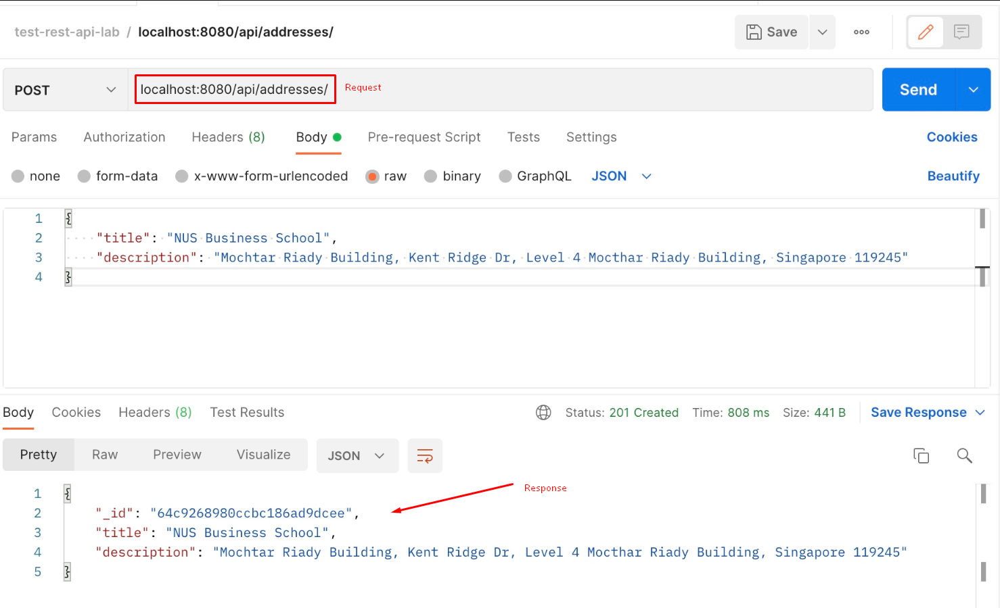
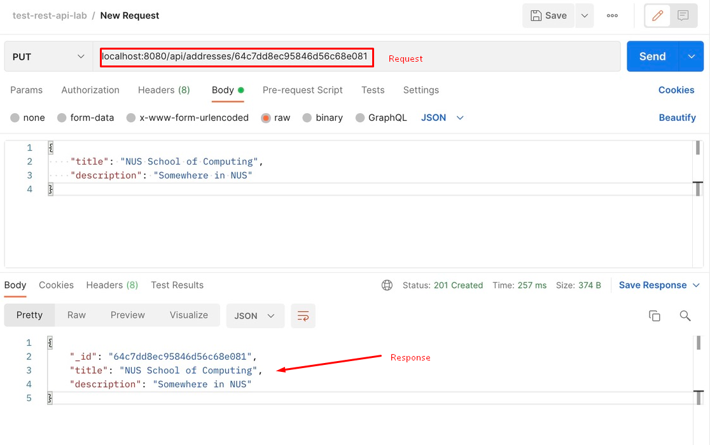
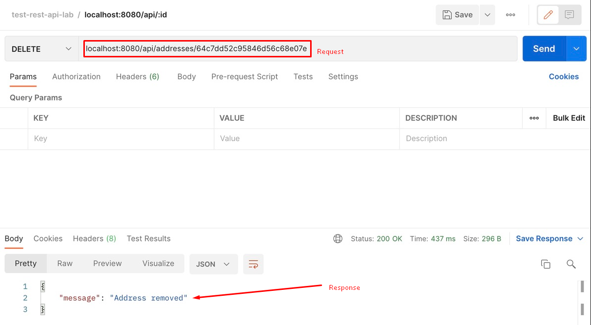

# Toolbox: REST APIs and MongoDB

## Introduction

Welcome to CS3219! This guide will introduce you to REST APIs and how to implement them by walking you through the development of a full stack address book application with CRUD functionalities (similar to CS2103, but with Javascript instead of Java).


### Tech Stack

###### Frontend

- [Next.js](https://nextjs.org/)

###### Backend

- [Express.js](https://expressjs.com/)
- [MongoDB](https://www.mongodb.com/)

###### Testing

- [Postman](https://www.postman.com/)

### Prerequisites

Please ensure that you have the following installed on your computer before continuing with the rest of the guide:

1. Install [Node.js LTS](https://nodejs.org/en/download)
> 📝 **Note:** The LTS version of Node.js as of the time of writing this guide is 18.X.X. If you have a different version of Node.js installed and you need to change it, there is a useful guide [here](https://developer.mozilla.org/en-US/docs/Learn/Server-side/Express_Nodejs/development_environment#installing_node) on how to do so using nvm.
2. Install [MongoDB Community Edition](https://www.mongodb.com/docs/manual/administration/install-community/) - Follow the installation guide for your OS
3. Install [Git](https://git-scm.com/downloads)
4. Install [Postman App](https://www.postman.com/downloads/)
5. Ensure you have an IDE of your choice installed (e.g. This guide was made using [VSCode](https://code.visualstudio.com/))

## Brief overview of REST API

### What is REST

A RESTful API (Representational State Transfer API) is a web-based architectural style for designing networked applications. It uses standard HTTP methods (e.g. `GET`, `POST`, `PUT`, `DELETE`) to perform CRUD (Create, Read, Update, Delete) operations on resources represented in a stateless manner. RESTful APIs are designed to be simple, scalable, and easy to consume, making them widely used for building web services and allowing different systems to communicate and interact over the internet. They typically respond with JSON or XML data and are the backbone of modern web applications and services.

### Purpose of REST API

- Provides a standardized way to access and manipulate resources on a server using common HTTP methods (e.g. `GET`, `POST`, `PUT`, `DELETE`).
- REST APIs allow developers to build scalable, interoperable, and stateless web services that can be consumed by various clients, such as web browsers, mobile apps, and other backend systems. They promote a simple and uniform architecture, making it easier to integrate and interact with diverse systems, and they are widely used in modern web development for building APIs that serve data and functionalities to different applications.

### REST API conventions
| Term | Description |
| --- | --- |
| Resource | The core concept in any RESTful API is resource. A resource is an object with a type, associated data, relationships to other resources, and a set of methods that operate on it. |
| Endpoint | One end of a communication channel in an API, typically identified by a URI, where requests are sent to access resource or trigger actions from web applications or servers, with responses returned to complete the interaction. Basically, the place that APIs send requests and where the resource lives, is called an endpoint. |
| Collection | Resources can be organized into collections, each of which is uniform, containing only a single type of resource, and unordered. |

- The endpoint refers directly to the resource and the HTTP verbs (e.g. `GET`, `POST`, `PUT`, `DELETE`) specify the actions.
- Typically takes 2 URI per resource
    - One for the whole collection
    - One for a single object in that collection
    - For example, consider a fictional resource called `address` that contains a list of addresses. The URI for the collection would be `/addresses` and the URI for a single address would be `/addresses/:id` where `:id` is the unique identifier of the address.
- You can also nest collections

## Setting up the Frontend

### 1. Fork and clone the starter repository

We have created a starter repository for this guide [here](https://github.com/CS3219-AY2324S1/SE-Toolbox-REST-API-MongoDB.git). This starter repository contains the code for the frontend of the application.

Fork this starter repository to your own Github account, then open your terminal and clone the forked repository into a directory of your choice.

```
// navigate to directory of your choice
cd <path to directory of your choice>

// clone the starter repository
git clone https://github.com/<your github username>/SE-Toolbox-REST-API-MongoDB.git
```

### 2. Install the required dependencies

Now that you have cloned the starter repository, you will need to navigate to it and install the dependencies required for the frontend of the application. The dependencies are listed in the `package.json` file in the root directory of the starter repository.

```
// navigate to starter repository
cd SE-Toolbox-REST-API-MongoDB

// install dependencies
npm install
```

### 3. Start up the frontend

You can now run the frontend of the application at `localhost:3000` by simply executing the command `npm run dev`.

## Setting up the Backend

### 1. Initialise the backend directory

You will now need to create a new folder `backend` within the starter repository to contain the source code for the backend of the application.

You can do so via your IDE or by executing the command `mkdir backend`

### 2. Initialise the `package.json` file

`package.json` is a file that contains important information about an application such as the entry point of the application, required dependencies and more. You can read more about it [here](https://docs.npmjs.com/cli/v10/configuring-npm/package-json) if you are interested.

You can create this file in the backend directory that you just created by running `npm init`. The steps are as follows:

```
// navigate to backend directory
cd backend

// create package.json file
npm init
```
> 💡**Tip:** `npm init` is an interactive command that will prompt you for some information. You can accept all the default arguments for this application.

### 3. Install the required dependencies

As mentioned earlier in the [Tech Stack](###Tech-Stack) section, you will be using Express.js for the backend of this application, so you will need to install it.

In addition, you will also be installing the following tools that will help to ease your development process:

1. [nodemon](https://www.npmjs.com/package/nodemon) reloads the backend server automatically when changes are made to the source code so that you don't have to manually restart it yourself.
2. [dotenv](https://www.npmjs.com/package/dotenv) allows you to make use of _environmental variables_ defined in a `.env` file to protect secrets.
3. [cors](https://www.npmjs.com/package/cors) allows you to enable CORS options and configure which domains your backend server can receive requests from. You can read more about CORS [here](https://developer.mozilla.org/en-US/docs/Web/HTTP/CORS) if you are interested.

You can install all these dependencies by executing these commands:

```
// install Express.js locally
npm i --save express

// install dotenv locally
npm i --save dontenv

// install cors locally
npm i --save cors

// install nodemon locally as a development dependency
npm i --save-dev nodemon
```
> 📝 **Note:** You can read more about the differences between --save and --save-dev [here](https://www.geeksforgeeks.org/what-is-the-difference-between-save-and-save-dev-in-node-js/) if you are interested.

### 4. Set up Express.js server

Create an `index.js` file in the `backend` directory and add the following lines of code. Make sure to read the inline comments to gain a better understanding of how the Express.js server works:

```js
// import the dependencies required for Express.js
const express = require('express')
// import the dependencies required for cors
const cors = require('cors')

// initialize the Express.js application
// store it in the app variable
const app = express()

// allow cross-origin requests to reach the Expres.js server
// from localhost:3000, which is your frontend domain
app.options(
  '*',
  cors({
    origin: 'http://localhost:3000',
    optionsSuccessStatus: 200,
  }), 
)
app.use(cors())

const PORT = 8080

// configure the Express.js application to run at port 8080
// since you will be running this application on your computer (localhost),
// the backend server will be running at http://localhost:8080
app.listen(PORT, () => {
  console.log(`Server is running on port ${PORT}...`)
})

// when a GET request is made to http://localhost:8080/, 
// the response will be { message: 'Hello World' } in JSON format
app.get('/', (req, res) => {
  res.json({ message: 'Hello World' })
})

// export Express.js application to be used elsewhere
module.exports = app
```

Make sure to read the inline comments to gain a better understanding of how the Express.js server works.


### 5. Start up the backend

In the `package.json` file, you should see one `test` script under the `scripts` section. You will need to add another `dev` script as follows:

```json
package.json

// rest of the code ...
"scripts": {
    "test": "echo \"Error: no test specified\" && exit 1",
    "dev": "nodemon index.js"
},
// rest of the code ...
```

Adding this script means that whenever you execute `npm run dev` in the backend directory, the `nodemon` tool will start up your backend server via the entry point `index.js`, which you had just set up in the previous step.

As such, you can execute the command `npm run dev` to run the backend server at `localhost:8080`.

## Setting up the Database

> 📝 **Note:** In this section, you will continue to work in the `backend` directory.

### 1. Install the required dependencies

You will need to install [mongoose](https://mongoosejs.com/docs/guide.html), which is an Object Relational Mapping (ORM) tool that makes it easier and simpler for developers to interact with MongoDB functionalities.

You can do so via executing the command `npm install mongoose`.

### 2. Initialise `.env` file for environmental variables

In your `backend` directory, create a file called `.env`. You can do so via the your IDE or by executing the command `touch .env`.

Then, add the following content to your `.env` file:
```
PORT=8080
MONGODB_URI="mongodb://127.0.0.1:27017/cs3219-rest-api-example"
```
Here, you are specifying the connection string that can be used to connect to your database. The format for this connection string is `<standard_prefix>://<host>:<port>/<database_name>`. In this example:

- `<standard_prefix>` is simply `mongodb`, which refers to the MongoDB Community Edition Server running on your computer.

You can read more about MongoDB connection strings [here](https://www.mongodb.com/docs/manual/reference/connection-string/#std-label-connections-standard-connection-string-format) if you are interested.

### 3. Initialise the database and connect to it

> ⚠️ **Warning:** This step will require you to have MongoDB server running on your computer, which should be the case if you followed the [Prerequisites](#Prerequisites) section and correctly followed the MongoDB installation guide for your OS. If not, please do it before continuing with the rest of this guide.

You will need to create a folder called `config` under your `backend` directory. You can do so via your IDE or by executing the command `mkdir config`.

Then, you will need to create a file called `db.js`. You can do so via your IDE or by executing the following commands:
```
// navigate to config directory
cd config

// create db.js file
touch db.js
```

In your `db.js` file, add the following code. Make sure to read the inline comments to gain a better understanding of how setting up a connection to MongoDB works:
```js
// import dependencies required for mongoose
const mongoose = require('mongoose')

// function to start up and connect to MongoDB database
const connectDB = async () => {
  try {
      // attempt to connect to MongoDB database via the connection string specified in .env file
    const con = await mongoose.connect(process.env.MONGODB_URI) // read from the .env file
    console.log(`MongoDB Connected: ${con.connection.host}`)
  } catch (error) {
    console.log(error)
    process.exit(1)
  }
}

// export connection function to be used in index.js
module.exports = connectDB
```

Make sure to read the inline comments to gain a better understanding of how setting up a connection to MongoDB works.

Now, you will need to make use of this `connectDB` function in the backend entrypoint `index.js`. Make the following changes to `index.js` to connect to the MongoDB database when starting up the backend server:

```js
/** code to import the express and cors dependencies ... (same as before) **/

// ADD the following code:

// import the dependencies required for dotenv
// the config() function allows for reading of the .env file
const dotenv = require('dotenv').config()
// import the connectDB function created earlier
const connectDB = require('./config/db')

// initialize connection to MongoDB database
connectDB()


/** 
 * code to initialize the Express.js application store it in the app variable ... (same as before)
 * code to allow cross-origin requests to reach the Express.js server ... (same as before) 
**/

// THEN replace const PORT = 8080 with the following:

// use 8080 as a fallback if PORT is undefined in .env file
const PORT = process.env.PORT || 8080

/** rest of the code ... (same as before) **/
```

## Implementing REST API

> 📝**Note:** In this section, you will continue to work in the root of the `backend` directory.

This is what the folder structure of the `backend` directory will look like by the end of this section:

```
├── backend
│   ├── config
│   ├── controllers
│   ├── models
│   └── routes
```

- `controllers` contains functions that will be handling business logic.
- `models` contains your mongoose Models, which essentially act as an interface to interact with different schemas in the MongoDB database.
- `routes` contains files that specify the endpoints supported by the backend server.


You can create these 3 new folders via your IDE or by executing the following commands:

```
// create controllers folder
mkdir controllers

// create models folder
mkdir models

// create routes folder
mkdir routes
```

### 1. `GET` - Fetch all addresses

#### Define the `Address` model

In the `models` directory, create `addressModel.js` with the following content:

```js
const mongoose = require('mongoose')

const addressSchema = mongoose.Schema({
  title: {
    type: String,
    required: [true, 'Please enter address title'],
  },
  description: {
    type: String,
    required: [true, 'Please enter address description'],
  },
})

// export Address model to be used in controller
module.exports = mongoose.model('Address', addressSchema)
```

#### Define `fetchAllAddresses` function

In the `controllers` directory, create `addressController.js`. Here, you will define a function that will handle the logic behind fetching all the addresses from the MongoDB database:

```js
// import Address model
const Address = require('../models/addressModel')

// @desc    Fetch all addresses
// @route   GET /api/addresses
// @access  Public
const fetchAllAddresses = async (req, res) => {
  // function provided by Mongoose to fetch all Address documents
  const addresses = await Address.find({})

  // return all addresses in JSON format 
  // with success status 200
  res.status(200).json(addresses)
}

// export controller functions to be used in corresponding route
module.exports = { fetchAllAddresses }
```

#### Define API route

Your api endpoints for addresses will look something like this: `/api/addresses/...` e.g. `/api/addresses/:id`

In the `routes` directory, create `addressRoutes.js`, this is where we will define the specific endpoints.

```js
const express = require('express')
const router = express.Router()

const { fetchAllAddresses } = require('../controllers/addressController')

// call the fetchAllAddresses function
// when a GET request is made to http://localhost:8080/api/addresses/
router.route('/').get(fetchAllAddresses)

module.exports = router
```

Then, you can add the following to `index.js` to connect the newly created address router:

```js
/**
 * Import required dependencies, connect db and initialize Express.js application ... (same as before). i.e. same up to: 
 * app.use(cors()) 
 **/

// ADD the following code:

// allow JSON data in request body to be parsed
app.use(express.json())
// allow URL-encoded data in request body to be parsed
app.use(express.urlencoded({ extended: false }))

/**
 * Define port and start up Express.js application ... (same as before). i.e. same up to:
 * app.listen(PORT, () => {...})
 **/

// ADD the following code: 

// use the address router to handle requests 
// at http://localhost:8080/api/addresses
app.use('/api/addresses', require('./routes/addressRoutes'))

/** rest of the code ... (same as before) **/
```

#### Test API route

To test whether the endpoint works correctly, you can use Postman App to make a `GET` request to `localhost:8080/api/addresses/`

The output should be as follows if there is no address object in the MongoDB database:


However, if you were to manually add an address first, it would look as follows:


### 2. `POST` - Add a new address

#### Define `addAddress` function

In `addressController.js`, you will define another function that will handle the logic behind adding a new address to the MongoDB database:

```js
// rest of the code ...

// @desc    Add an address
// @route   POST /api/addresses
// @access  Public
const addAddress = async (req, res) => {
  const { title, description } = req.body

  // validate request body
  if (!title || !description) {
    return res.status(400).json({ message: 'Please enter all fields.' })
  }

  try {
    // function provided by Mongoose to create a new Address document
    const address = await Address.create({
      title,
      description,
    })

    // return the newly created Address in JSON format
    // with created success status 201
    res.status(201).json({
      _id: address._id,
      title: address.title,
      description: address.description,
    })
  } catch (error) {
    // catch exception when fields are missing
    res.status(400).json({ message: 'Invalid address data.' })
  }
}

// export controller functions to be used in corresponding route
module.exports = { fetchAllAddresses, addAddress }
```

#### Define API route

In `addressRoutes.js`, define another route as follows.

```js
// rest of the code ...

const { fetchAllAddresses, addAddress } = require('../controllers/addressController')

// rest of the code ...

// call the addAddress function
// when a POST request is made to http://localhost:8080/api/addresses/
router.route('/').post(addAddress)

// rest of the code ...
```

#### Test API route

To test the endpoint, you can make a `POST` request to the endpoint using Postman App as follows:



> 💡 **Tip:** Add a few more addresses to the database. For example, you can add an address for 'NUS School of Computing' with description 'Somewhere in NUS'. Take note of the ID returned by the `POST` request as you will need it to test the `PUT` and `DELETE` endpoints later on.

### `PUT` - update an existing address

#### Define `updateAddress` function

In `addressController.js`, you will define another function that will handle the logic behind updating an existing address to the MongoDB database:

```js
// rest of the code ...

// @desc    Update an address
// @route   PUT /api/addresses
// @access  Public
const updateAddress = async (req, res) => {
  const { title, description } = req.body

  // validate request body
  if (!title || !description) {
    return res.status(400).json({ message: 'Please enter all fields.' })
  }

  try {
    // function provided by mongoose to find an
    // Address document with a given ID
    // req.params.id is retrieved from /:id in route
    const address = await Address.findById(req.params.id)

    // update the document
    address.title = title
    address.description = description

    // function provided by mongoose to
    // save the changes made to a document
    await address.save()

    // return the updated address in JSON format
    // with success status 200
    res.status(200).json({
      _id: address._id,
      title: address.title,
      description: address.description,
    })
  } catch (error) {
    res.status(400).json({ message: 'Invalid address data.' })
  }
}

// export controller functions to be used in corresponding route
module.exports = { fetchAllAddresses, addAddress, updateAddress }
```

#### Define API route

In `addressRoutes.js`, define another route as follows.

```js
// rest of the code ...

const { fetchAllAddresses, addAddress, updateAddress } = require('../controllers/addressController')

// rest of the code ...

// call the updateAddress function
// when a PUT request is made to http://localhost:8080/api/addresses/:id
router.route('/:id').put(updateAddress)

// rest of the code ...
```

#### Test API route

To test the endpoint, you can make a `PUT` request to the endpoint using Postman App as follows.

In this example, the ID we want to update is `64c7dd8ec95846d56c68e081`. Note that you must make a request to the endpoint with the ID of the address that you want to update:



### `DELETE` - delete an existing address

#### Define `deleteAddress` function

In `addressController.js`, you will define another function that will handle the logic behind deleting an existing address to the MongoDB database:

```js
// rest of the code ...

// @desc    Delete an address
// @route   DELETE /api/addresses
// @access  Public
const deleteAddress = async (req, res) => {
  try {
    // function provided by mongoose to find an
    // Address document with a given ID
    // req.params.id is retrieved from /:id in route
    const address = await Address.findById(req.params.id)
    
    // function provided by mongoose to delete a document
    await address.deleteOne()
      
    
    res.status(200).json({ message: 'Address removed' })
  } catch (error) {
    res.status(404).json({ message: 'Address not found' })
  }
}

// export controller functions to be used in corresponding route
module.exports = { fetchAllAddresses, addAddress, updateAddress, deleteAddress }
```

#### Define API route

In `addressRoutes.js`, define another route as follows.

```js
// rest of the code ...

const { fetchAllAddresses, addAddress, updateAddress, deleteAddress } = require('../controllers/addressController')

// rest of the code ...

// call the deleteAddress function
// when a DELETE request is made to http://localhost:8080/api/addresses/:id
router.route('/:id').delete(deleteAddress)

// rest of the code ...
```

#### Test API route

To test the endpoint, you can make a `DELETE` request to the endpoint using Postman App as follows.

In this example, the ID we want to delete is `64c7dd52c95846d56c68e07e`. Note that you must make a request to the endpoint with the ID of the address that you want to update:



## Integrating with the Frontend

> 📝 **Note:** For this section, you will be working in the root directory of the repository as you will be making changes in the frontend code. Make sure to navigate such that your working directory is `<directory of your choice>/SE-Toolbox-REST-API-MongoDB`.

You will need to install [axios](https://www.npmjs.com/package/axios), a useful tool that will allow you to make requests to the backend server. You can do so by executing the command `npm install axios`.

### Understanding the folder structure

This is what the folder structor of the starter repository should look like at this point:

```
├── .next
├── app
    ├── page.js
    ├── ...
├── backend
├── components
├── node_modules
├── public
├── ...
```

- `components` contains reusable UI components
- `app/page.js` is the file that contains the code for the single-page frontend application

### Fetch all addresses

To fetch and display all addresses on the frontend, you can make a `GET` request to `http://localhost:8080/api/addresses/` from the `AddressCardList` component in `AddressCardList.jsx`. This can be found in the `components` directory.

Replace the existing `addresses` variable with the `useState` hook and fetch the data as follows:

```jsx
// rest of the code ...

const [addresses, setAddresses] = useState([])

useEffect(() => {
    const fetchAddresses = async () => {
      try {
        // make a GET request to backend server via axios
        const response = await axios.get('http://localhost:8080/api/addresses')
        // update the addresses state with the retrieved data
        setAddresses(response.data) 
      } catch (error) {
        console.error('Error fetching addresses:', error)
      }
    }

    fetchAddresses()
}, [addresses])
```

### Add a new address

To add a new address via the frontend, you can make the `InputButton` component in `InputButton.jsx` (in the `component` directory) fire a `POST` request to `http://localhost:8080/api/addresses/` when it is clicked.

Here are some code snippets to help you get started:

```jsx
// rest of the code ...
const onSubmit = async (data) => {
  try {
    await axios.post('http://localhost:8080/api/addresses', data)
    setOpen(false)
  } catch (error) {
    console.error('Error creating address:', error)
  }
}
```

`onSubmit` can be used as follows in `InputButton.jsx`:

```jsx
<form onSubmit={form.handleSubmit(onSubmit)} className="w-2/3 space-y-6">
  ... // form fields for title and description of address
  ... // existing InputButton code
</form>
```

### Update an existing address

To update an existing address, you can define another `onSubmit` function that makes a `PUT` request to `http://localhost:8080/api/addresses/:id`

```jsx
const onSubmit = async (data) => {
  try {
    await axios.put(
      `http://localhost:8080/api/addresses/${props.address._id}`,
      data,
    )
    setOpen(false)
  } catch (error) {
    console.error('Error updating address:', error)
  }
}
```

### Delete an existing address

To delete an existing address, you can define a click handler that makes a `DELETE` request to `http://localhost:8080/api/addresses/:id`

```jsx
const handleDeleteAddress = async () => {
    try {
      await axios.delete(
        `http://localhost:8080/api/addresses/${props.address._id}`,
      )
    } catch (error) {
      console.error('Error deleting address:', error)
    }
  }
```

Here is one example of how`handleDeleteAddress` can be used:

```jsx
<AlertDialogAction onClick={handleDeleteAddress}>Continue</AlertDialogAction>
```

## References

Here are some of the resources that were used in the making of this guide. You may find these reads to be useful in helping to further your understanding of REST APIs and the best ways to implement them.

### REST API

- [Express web framework (Node.js/JavaScript)](https://developer.mozilla.org/en-US/docs/Learn/Server-side/Express_Nodejs)
- [How to create a REST API with Express.js in Node.js](https://www.robinwieruch.de/node-express-server-rest-api/)

### Best practices

- [Best practices for REST API design](https://stackoverflow.blog/2020/03/02/best-practices-for-rest-api-design/)
- [REST API Best Practices – REST Endpoint Design Examples](https://www.freecodecamp.org/news/rest-api-best-practices-rest-endpoint-design-examples/)
